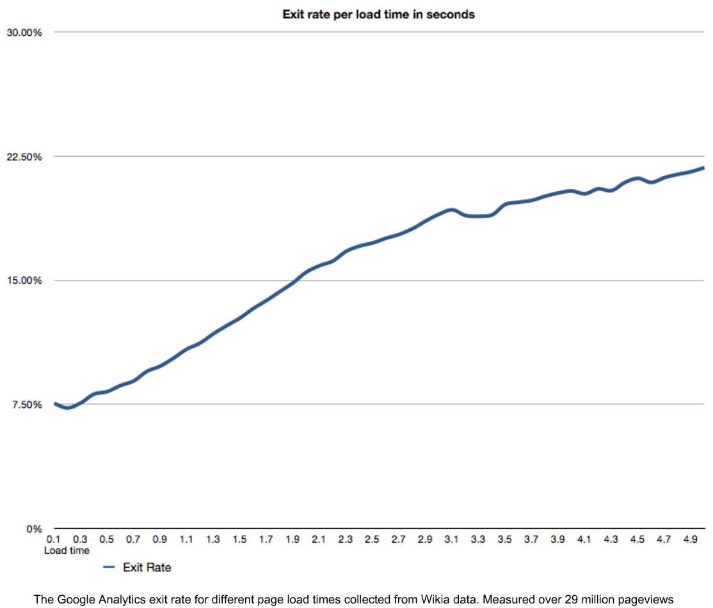
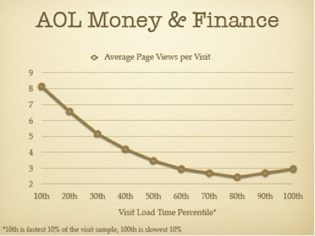
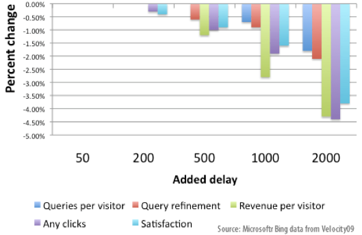
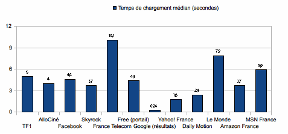
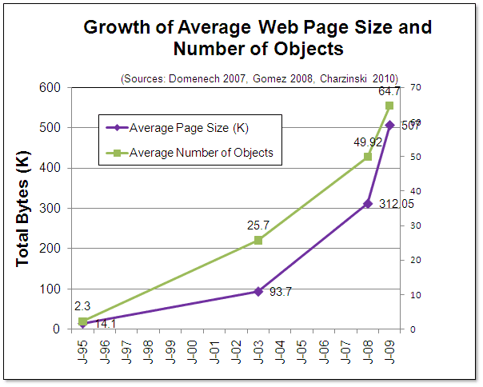
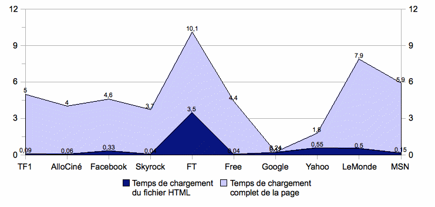
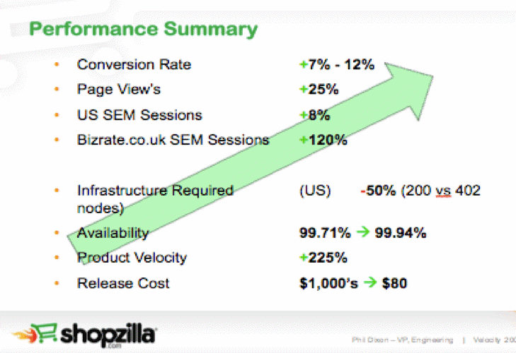

Users really respond to speed
=====================

(en français : les utilisateurs réagissent vraiment à la vitesse)

J’ai souhaité insérer la question du pourquoi en tout premier chapitre.
Quand j’ai commencé à parler de performance des sites web je me suis
retrouvé face à un mur, à chaque fois. Tout le monde s’accorde à dire
qu’il s’agit d’un sujet important mais dès qu’on entre dans le concret
il y a toujours une bonne raison pour laisser ça de côté, souvent une
très bonne raison même. Bref, « c’est important mais pas pour moi, ou
pas maintenant ».

Ce n’est que par la suite que j’ai compris que sur ce sujet il fallait
d’abord tordre le cou aux idées reçues avant de le développer. C’est la
raison d’être de ce chapitre. Lisez-le en entier avant de passer à la
suite, n’en sautez pas une page. Après sa lecture vous devriez envisager
de bousculer l’ordre de vos priorités et insérer la performance dans les
premières lignes. Si à un quelconque moment vous doutez, revenez faire
un tour sur ce chapitre.

Vous verrez de nombreux liens en bas de page. Il n'est pas nécessaire
d'aller lire les présentations ou les études qui sont liées, même si ça
ne fait pas de mal, mais il me paraissait important de montrer les
sources de chaque affirmation présente ici. Ces liens  permettent de
prouver qu'il ne s'agit pas de chiffres jetés au hasard : il s'agit
d'études et tests réalisés par les plus gros acteurs du web, diffusés
publiquement par eux-même, et recoupés par des retours d'expérience de
nombreux autres. Les chapitres suivants seront moins pollués par ces
liens en bas de page, promis.

Les performances impactent votre business, Amazon et Aberdeen
--------------------------------------------------------------------------------

Pour attirer votre attention, voici les premiers chiffres du livre : 

> + 100 ms de latence → - 1 % de ventes [^1]

  [^1]: Greg Linden, Amazon.com, dans sa présentation [« Make Data Useful » donnée en novembre 2006, page 15](http://sites.google.com/site/glinden/Home/StanfordDataMining.2006-11-28.ppt)

Amazon a constaté dans des tests utilisateurs que chaque
100 millisecondes de latence en plus lors du chargement de leurs pages
web induisait une chute de 1 % des ventes. C’est factuel, simple, mais
brutal : on parle de ventes, de l'objectif du site d'Amazon. Perdre des
ventes c'est un échec qui doit retenir l'attention de tous, du
développeur au directeur.

Une étude Aberdeen Group est tout aussi claire :

> Un délai d'une seconde dans le chargement de la page entraîne une baisse
> de 11 % du nombre de pages vues, une baisse de 16 % de la satisfaction
> client, et une perte de 7 % en conversions. [^2]

  [^2]: Aberdeen Group, étude [« The Performance of Web Applications: Customers are Won or Lost in One Second » du 30 novembre 2008](http://www.aberdeen.com/Aberdeen-Library/5136/RA-performance-web-application.aspx) 

Votre site met probablement plus de deux secondes à se charger
entièrement une fois que l’utilisateur a cliqué sur un lien. À
l’écriture de ces lignes la page d’accueil de TF1.fr met 5 secondes.
Pour prendre plus extrême, FranceTelecom.com met parfois plus de 11 
secondes.

Bien que tout ne soit pas transposable ou comparable, quand un site web
met plus de 5 secondes, que des centaines de millisecondes se
traduisent déjà en 1 % des ventes fait réfléchir. Combien perdez-vous à
cause des mauvaises performances de votre site web ?

Ce qui est sûr c’est que les utilisateurs réagissent en fonction des
performances des sites web. Si votre site est lent, ce sont vos
utilisateurs qui partent et leurs intentions d’achat qui s’écroulent.
Bref, ils abandonnent ou se freinent.

Le titre de ces quelques paragraphes, « Users really respond to
speed » est en fait une citation de Marissa Mayer, lorsqu'elle était vice-présidente de
la section recherche et expérience utilisateur de Google. Nous le
verrons, Google a aussi publié des chiffres, pas moins impressionnants
que ceux d’Amazon.

Charger la page en une à trois secondes
------------------------------------------------

Vous prendrez le TGV ou le bus pour vos vacances ? Le TGV bien entendu,
sauf pour les marchés de niche comme les étudiants pendant les vacances
d’été. Et encore, le train devient de plus en plus la première option
considérée. Ce n’est pas tellement pour le confort, ce n’est
certainement pas pour le prix, c’est pour la vitesse.

Il y a dix ans la vitesse était un critère exprimé dans les sondages à
propos des sites Internet. Jakob Nielsen, gourou de l’utilisabilité du
web, en parlait déjà en mai 1996 comme une des dix plus grosses erreurs
du design web [^3]. Il en reparle en 1997, 1999, 2000, 2004, 2010 [^4], mais
finalement pas grand chose n’a changé. Malgré l’explosion des débits,
entre 100 et 2000 fois supérieurs à ceux de 1996, on trouve encore des
gros sites de multinationales avec des temps de chargement approchant la
dizaine de secondes.

  [^3]: Jakob Nielsen, dans son AlertBox de mai 1996 intitulée [« Original Top Ten Mistakes in Web Design »](http://www.useit.com/alertbox/9605a.html)
  [^4]: Alert box [« Website Response Times » du 21 juin 2010](http://www.useit.com/alertbox/response-times.html)

Le problème est que les usages ont changé, eux. À l’époque le simple
fait de se connecter était considéré comme une réussite. Maintenant
c’est une action quotidienne, voire instinctive pour certains, et on
attend une réactivité en conséquence. La page doit arriver vite, très
vite. 

Lors de recherches sur Internet les visiteurs décident souvent en
quelques dixièmes de secondes si la page est potentiellement
intéressante ou s’ils repartent ailleurs. Au bout de quelques secondes à
attendre, la confiance s’effondre, l’intérêt s’effrite. Après trois à
quatre secondes les abandons deviennent fréquents et la situation peut
devenir catastrophique. C’est parfois le site complet qui est abandonné
par l’utilisateur et l’image négative se diffuse vite par le bouche à
oreille.

Jakob Nielsen identifie de manière stable depuis plus de quinze ans
trois paliers de perception de la vitesse :

-   0,1 seconde : En dessous du dixième de secondes la réponse est perçue
    comme instantanée. C'est la limite haute pour la manipulation de
    l'interface (clic sur un bouton, glisser/déposer, menu déroulant,
    etc.)
-   1 seconde : La seconde est le palier de fluidité. Jusque là
    l'utilisateur perçoit le délai mais a encore une navigation fluide
    sans avoir l'impression d'attendre la machine. C'est cette limite
    qu'il faudrait dans l'idéal viser pour une navigation interne dans
    un logiciel. Au delà il y a une impression d'attente, et donc de
    frustration.
-   10 secondes : C'est la limite de l'attention. Jusqu'à 10 secondes
    l'utilisateur se sent à la merci de la machine mais peut accepter
    d'attendre. Au-delà il commence à penser à autre chose, voire à
    réaliser des actions tierces et revient à la machine plus tard pour
    constater la progression.

Bien entendu ces paliers ne sont pas précis. Ils dépendent du contexte
et de l'utilisateur, mais les ordres de grandeur sont valables pour
quasiment toute situation.

Le web a ses habitudes et ses usages. Il est fréquent de devoir dépasser
la seconde – même si vous verrez que c'est le temps de réaction de
Google par exemple, ce n'est pas un hasard. 

Nous pouvons probablement parler d'un palier intermédiaire entre la
seconde et les 10 secondes. Le côté fortement concurrentiel du web fait
qu'un utilisateur a peu d'intérêt à attendre 10 secondes, il a plus vite
fait d'aller sur un site concurrent qui lui se charge rapidement. Au
delà de 3 à 4 secondes, les conséquences négatives deviennent non
négligeables.

Plus récemment on a pu voir une statistique tirée de Google Analytics
mettant en rapport le temps de chargement d'un jeu de pages référence
avec le taux d'abandon. Ce dernier monte progressivement, quasiment
proportionnellement au temps de chargement de 0 à 5 secondes.

[^5]

  [^5]: Illustration originale dans la conférence [« Varnish – A State of the Art High-Performance Reverse Proxy »](http://www.oscon.com/oscon2009/public/schedule/detail/10433) d'Artur Bergman donnée à l'OSCON le 23 juillet 2009

Votre commerce et votre marque en pâtissent, l’étude Akamaï
----------------------------------------------------------------------------

Dans une étude de 2006, Akamaï et JupiterResearch ont mesuré l’impact
des performances auprès de 1000 marchands en ligne. Ils ont trouvé que
la lenteur d’un site marchand est le motif d’insatisfaction principal,
juste après les prix trop élevés.

Un tiers des clients avec une mauvaise expérience a en effet abandonné
le site entièrement et les trois quarts ne reviendront probablement plus
par la suite. Le palier d'insatisfaction se situait à 4 secondes.
Au delà les abandons deviennent très importants.

Akamaï a relancé une étude similaire en 2009 avec Forrester Consulting.
Là c'est à partir de 3 secondes pour le chargement de la page qu'on
identifie 57 % d'abandon parmi les acheteurs, et 80 % qui ne reviendront
plus s'ils ont eu un résultat inapproprié. Ces paliers de 3 ou
4 secondes sont une limite haute à ne pas dépasser, pas un
objectif à atteindre.

De plus, ces mauvaises performances rejaillissent sur la perception de
la boutique et de la marque. 30 % des visiteurs vont ainsi développer
une perception négative de la société ou partager leur (mauvaise)
expérience avec leurs amis ou leur famille.

Vos utilisateurs ne vous le diront pas forcément, mais ils attendent de
votre site qu'il soit rapide. C’est tellement naturel qu’ils ne
nommeront probablement pas le critère. Partout pourtant, quand on teste
et que des études sont conduites, la vitesse est un critère de choix même s’il
n’est pas exprimé. Plus qu’un critère, c’est en fait un pré-requis.

Votre visibilité est aussi impactée
-----------------------------------------

Depuis quelques temps Google a rejoint Yahoo! pour communiquer auprès
des développeurs de sites web et leur enseigner comment améliorer les
performances. C'est ainsi que Steve Souders, autrefois à Yahoo! est
passé chez Google. Depuis Google a sorti l'extension de Firefox « Page
Speed », concurrent de Yslow de Yahoo!. Les deux servent à analyser une
page pour y trouver les pistes d'amélioration de performance.

Quelques voix le soupçonnaient auparavant mais Google l'a désormais
annoncé officiellement : la performance des sites web influe sur les
métriques internes du moteur et sur votre référencement. 

Les performances jouent par exemple sur le positionnement du site dans
les résultats de recherche (activité SEO). Le temps de chargement des
pages devient un des 200 critères de tri de Google. Avoir un site qui se
charge à la vitesse de la lumière ne permettra pas d'avoir la première
place, mais de mauvaises performances rétrograderont le site à une plus
mauvaise place.

Les performances jouent aussi sur le « quality score » (le score
qualité) de la partie adWords de Google (activité SEM). Ce score est
affecté à chaque site et à chaque page ciblée par une publicité (page
destination quand on suit la publicité). Il permet de déterminer la
place de la publicité dans le moteur de recherche et modifie le coût
d'insertion dans le système adWords. Plus le site et la page destination
seront lents, moins la publicité aura une bonne place et plus elle
coûtera cher.

Si ce critère de performance n'est pas le seul, et pas forcément le plus
important, il est un de ceux qui sont facilement manipulables par les
équipes techniques des sites web. 

Google aide même ces équipes en proposant l'outil Google Page Speed et
en l'intégrant dans ses outils en ligne Webmaster Tools ou Google
Analytics. Il est extrêmement probable que les métriques générées par ces
outils soient exactement celles prises en compte en interne dans les
moteurs de Google.

Les cas Google, Microsoft, AOL et Yahoo!
---------------------------------------------------

Plus haut je vous ai cité le cas d’Amazon, qui voit ses ventes chuter de
1 % pour chaque tranche de 100 ms de latence. Il y a en fait d'autres
poids lourds qui ont donné des chiffres sur ce sujet : Google,
Microsoft, AOL et Yahoo! Ce dernier a même créé une équipe dédiée au
sujet (nommée « exceptional performance ») et a communiqué le résultat
de ses recherches auprès de la communauté des développeurs web. Tous les
quatre ont un ressenti similaire, même si les chiffres et leur
signification sont différents à chaque fois.

Google a mené plusieurs expérimentations sur les performances dans leur
page de recherche. Un premier résultat fait état d'une perte de 20 % de
trafic pour un ralentissement d'une demi seconde de la page[^6].

> + 500 ms au chargement → - 20 % de trafic

  [^6]: Marissa Mayer, VP section recherche et expérience utilisateur, Google, [Conferences Scalability 2007 de Seattle](http://www.techpresentations.org/Scaling_Google_for_Every_User)

D'autres facteurs sont peut être intervenus en parallèle pour affecter à
ce point le test (il présente par exemple 30 résultats par page au lieu
des 10 habituels) et d'autres tests plus récents ont des résultats
beaucoup plus mesurés. La corrélation entre performance et fidélité du
trafic est toutefois plus que certaine mais il est difficile
d'individualiser tous les facteurs qui interviennent.

Par contre même ces derniers tests amènent un résultat complémentaire
inquiétant : ceux qui ont un jour fait partie des utilisateurs « test »
ayant reçu une page plus lente ont tendance à faire moins de recherches
par la suite, même plusieurs semaines après que le test soit fini et que
la vitesse des pages soit revenue à la normale. De mauvaises
performances, même temporaires, peuvent vous faire perdre durablement la
confiance des internautes.

Leur second retour d’expérience concerne le service Google Maps. Après
avoir réduit le poids de leur page de 30 %, le trafic a augmenté de 10 %
la première semaine, puis encore 25 % par la suite[^7]. 

> - 30 % sur le poids de la page → + 10 % puis + 25 % de trafic

  [^7]: Marissa Mayer, VP section recherche et expérience utilisateur, Google, [conférences Web 2.0 en novembre 2006](http://www.zdnet.com/blog/btl/googles-marissa-mayer-speed-wins/3925)

Le retour d’expérience suivant vient de Yahoo! Sur leurs tests
comparatifs, un délai de 400 ms induit immédiatement 5 à 9 % d’abandon[^8],
c’est à dire de gens qui ne vont pas plus loin et qui ne cliquent sur
aucun lien ni aucune publicité.

> + 400 ms au chargement → - 5 à 9 % d’abandon

  [^8]: Présentation de Stoyan Stefanov (Yahoo!)  [« Yslow 2.0 early preview » en décembre 2008 en Chine](http://www.techpresentations.org/YSlow_2.0_early_preview_in_China)

Pour AOL la découverte se fait plus en termes d'intérêt et de motivation
du visiteur. Plus les pages sont lentes à charger, moins le visiteur va
en visiter. La courbe est assez franche, presque droite au départ.
Ainsi, les 10 % de visiteurs qui ont les pages les plus rapides lisent
en moyenne 8 pages par visite. Cela descend entre 6 et 7 pour les 10 %
suivants, puis 5 pages par visite pour le troisième décile, 4 pages pour
le quatrième, etc.[^9] Les 50 % de visiteurs qui ont les plus mauvaises
performances visitent moins de 3 pages par visite en moyenne. C'est
presque trois fois moins que le premier décile. L'influence du temps de
chargement est donc indéniablement perceptible.

  [^9]: Présentation Dave Artz, Director of optimization, AOL, aux [conférences Velocity 2009](http://en.oreilly.com/velocity2009/public/schedule/detail/7579)

Enfin, sur Bing, un ralentissement influe sur le visiteur dès 200 ms. À
partir de 500 ms on voit déjà une baisse de plus de 1,2 % du revenu par
visiteur[^10]. Avec une ou deux secondes de ralentissement ce sont
respectivement 2,8 % et 4,3 % de perte de revenu par utilisateur. Ces
effets négatifs sont accompagnés de pertes de satisfaction utilisateur,
de plus faibles taux de clics, et d'une diminution de la propension des
visiteurs à affiner et approfondir leur recherche.

> + 500 ms au chargement → - 1,2 % de revenus

> + 1 s au chargement  → - 2,8 % de revenus

> + 2 s au chargement  → - 4,3 % de revenus

  [^10]: Intervention Bing aux [conférences Velocity 2009](http://en.oreilly.com/velocity2009/public/schedule/detail/8523)

La baisse de revenus publicitaires est d'ailleurs corrélée par une étude
de Jackob Nielsen en juin 2010 : après un grand délai d'attente
l'utilisateur se concentre sur le contenu et est bien moins à même de
s'arrêter sur les contenus promotionnels. Jackob évoque le passage de
20 % d'attention au promotionnel pour 1 seconde d'attente à 1 %
d'attention au promotionnel seulement après 8 secondes d'attente.

Certes, tout le monde n’est pas Google, Microsoft, AOL, Amazon ou Yahoo!
Il n’est pas possible de transposer immédiatement ces chiffres sur votre
site. En revanche ce qui est certain c’est que vos utilisateurs
réagiront aux performances de votre site. Il y aura une influence réelle
sur votre trafic, vos ventes, la fidélité de vos utilisateurs, et la
confiance qu’ils auront dans votre site et votre marque. Toutes les
études confirment que c’est significatif, même pour des chiffres en
apparence négligeables. Ne vous croyez pas différents, votre site ne
l’est probablement pas.

Malgré l’augmentation des débits, le web est lent
------------------------------------------------------------

Le web est malheureusement en mauvais état par rapport aux performances.
Je vous ai cité en début de chapitre les cas de TF1 et de France Telecom
avec respectivement un peu plus de 5 secondes et un peu moins de 10 
secondes en moyenne. On se situe presque toujours au delà des 2
secondes, quel que soit le site, et trop souvent au-delà de 3, voire
de 5 secondes. 

Ici, dans une liste arbitraire de sites mesurés sur une connexion ADSL
de très bonne qualité, presque la moitié sont au dessus des 4 secondes :

Si les débits et la puissance des machines ont explosé, les développeurs
ont aussi fait moins attention au poids des pages, à leur contenu, à
leur utilisation. En cinq ans (2003 à 2008) on a entre autres triplé le
poids des pages [^11], doublé le nombre de composants par page, et doublé le
nombre de balises HTML. Entre 2008 et 2009 l'augmentation a été encore
plus importante. 

Au total, en moyenne, le poids des pages est de plus de 500 kilo octets,
avec près de 65 composants par page et pour seulement 500 mots. Si
l'étude ne va pas jusqu'en 2010, avec la multiplication des
bibliothèques javascript et des effets visuels, on peut sans risques
continuer les courbes sur leur progression d'alors.

  [^11]: Étude avec sources sur websiteoptimizations.com, [« Average Web Page Size Triples Since 2003 » d’avril 2008](http://www.websiteoptimization.com/speed/tweak/average-web-page/)

Bref, on a un gros gâchis mais c’est aussi une chance : cela signifie
que nous avons beaucoup de marge pour améliorer les choses et qu’il y a
certainement des actions simples et peu coûteuses à appliquer, avec des
effets qui seront exceptionnels. Ce livre est là pour vous donner ces
informations, et bien d’autres.

Le problème n’est pas sur le serveur
--------------------------------------------

Mais agir sur quoi d’abord ? Demandez en interne, autour de vous, on
vous proposera de mesurer le temps de génération des pages web,
d’optimiser votre code PHP ou Java, de mettre des index dans votre base
de données.

Ne vous en privez surtout pas. Une fois le gros du travail fait votre
page se générera en moins de 100 millisecondes mais votre site risquera
d'être toujours lent pour l’utilisateur. Ce qu’ont montré les études
récentes, c’est que la génération de la page HTML n’occupe en fait
qu’une toute petite partie du ressenti de l’utilisateur. C’est au niveau
du navigateur et du réseau que nos problèmes se logent.

### Moins de 20% du temps est passé sur la page HTML**

Steve Souders a mené des études pour mesurer le poids de la génération
de la page HTML dans le temps de chargement total. D'après ses résultats
seul 10 à 20 % du temps est du à la génération de la page par le serveur
applicatif, 80 % du temps est passé sur le navigateur ou sur le réseau.
Pour les gros sites français le rapport est même plus souvent de 95 / 5
que de 80 / 20.

Sur des mesures faites avec une douzaine de sites à fort trafic, on
remarque bien que, le plus souvent, le chargement de la page HTML de
base ne prend qu’un très faible pourcentage du temps total de
chargement. À part France Telecom qui a définitivement un problème de
redirections HTTP, les seuls pour qui la page principale est
significative sont ceux qui ont déjà de bonnes performances, donc qui
ont déjà travaillé pour optimiser le rendu côté client.

### Travailler sur la partie cliente est le meilleur investissement

Les mathématiques sont assez simples, et il vaut mieux gagner 5% sur la
partie cliente (90% du total) que 30% sur le temps de génération du
fichier HTML source (qui ne représente que 10% du total). Pour ne rien
gâcher, si votre applicatif et votre base de données ne sont pas
utilisés à tort et à travers, il est beaucoup plus facile de faire des
améliorations sur la partie cliente que sur la partie serveur.

Nous occuper du client – navigateur et réseau – offre de loin le
meilleur retour sur investissement. Ce livre porte donc tout
naturellement sur ces aspects, sur le côté navigateur et le côté réseau.
Nous discuterons ensemble de cache, du protocole HTTP, du fonctionnement
interne des navigateurs, et de compression.

Comme un peu de publicité ne fait jamais de mal, si vous souhaitez tout
de même travailler votre programmation serveur en PHP, je ne peux que
vous conseiller le livre *PHP 5 avancé* dans la collection blanche des
éditions Eyrolles. J'ai eu le plaisir de le co-écrire avec Cyril Pierre
de Geyer. Nous l'avons maintenu à jour et enrichi presque chaque année.
Ce sera le seul passage promotionnel, promis.

Une stratégie gagnante, d'autres chiffres
--------------------------------------------------

Plus que ces chiffres, c’est aussi l’assurance que la démarche a été un
succès de nombreux sites, dont Yahoo! qui en a fait un cheval de
bataille. Travailler sur les performances web vues du navigateur a
permis de réduire le temps de chargement des pages, et ainsi éviter de
perdre des clients et des visiteurs.

Les différences en trafic et en nombre de ventes sur les sites ont été
prouvées par des tests puis confirmées après mise en œuvre. Bien que
l’influence dépende du ressenti subjectif de l’utilisateur, ces
recherches ont permis de mettre en lumière des gains objectifs sur le
temps de chargement et de voir une réelle réaction positive des
utilisateurs se traduisant en taux de rebond, nombre de visites, ou taux
de transformation pour les ventes.

Pour finir sur une note positive, l'exemple Shopzilla est intéressant.
En refondant leur site web, ils ont amélioré le chargement des pages en
passant de 6 secondes à 1,2 secondes. Pour résultat tous leurs
indicateurs sont passés au vert : taux de transformation amélioré de 7 à
12 % et nombre de pages vues augmenté de 25 % [^12].

  [^12]: Intervention de Philip Dixon, VP of Engineering, Shopzilla, aux [conférences Velocity 2009](http://en.oreilly.com/velocity2009/public/schedule/detail/7709)

Mieux encore, cette expérience leur a permis de diviser par deux le
nombre de serveurs nécessaires et a diminué les coûts de déploiement de
plus de 90 %. On fait mieux pour moins cher.

Même chose chez Mozilla, leur équipe a aussi pu constater les effets
positifs du travail sur les performances web. En réduisant de
2,2 secondes le temps de chargement de leur page d'arrivée (celle qui
incite à télécharger le navigateur), ils ont pu augmenter de 15,4 % le
taux de transformation[^13].

  [^13]: Publication de Blake Cutler sur le blog officiel Mozilla, [le 5 avril 2010](http://blog.mozilla.com/metrics/2010/04/05/firefox-page-load-speed-%E2%80%93-part-ii/)

Strangeloops Networks, une société qui travaille sur les performances, a
aussi publié ses chiffres. Si, parce qu'ils sont intéressés aux
résultats qu'ils donnent, on ne peut pas forcément prendre leurs
graphiques pour argent comptant, ils montrent bien une amélioration sur
tous les fronts : taux de rebond, nombre de visites, pages par visite,
temps passé sur le site, fidélité (retour des anciens visiteurs) et taux
de conversion. C'est sur toutes ces métriques que vous pouvez espérer
jouer, en travaillant les points techniques détaillés dans le reste de
ce livre.

Impact des optimisations de performance par Strangeloops Networks :

* \- 7 % en rebonds (de 14,35% à 13,38%)
* \+ 42 % en pages par visite (de 11,04 à 15,64)
* \+ 27 % en temps passé sur le site (de 25 minutes 50 secondes à 30 minutes 10 secondes)
* \+ 16 % en conversions en achats en augmentation
* \+ 5,5 % en montant moyen des commandes

Retour sur investissement
--------------------------------

Nous avons vu des chiffres qui font peur, l'impact négatif de mauvaises
performances, où quelques dixièmes de secondes ont des conséquences
importantes. Nous avons vu que pour améliorer ces performances il vaut
mieux travailler sur la façade de l'application. Mais combien cela
coûte-t-il ? 

### Augmenter le bénéfice

En prenant l'exemple d'une boutique en ligne pour améliorer les
bénéfices on peut jouer sur le nombre de visiteurs attirés dans la
boutique, sur leur propension à faire des achats, et sur les coûts de la
boutique elle-même.

Le nombre de visiteurs dépend souvent fortement de la visibilité dans
les moteurs de recherche mais aussi du taux de rebond, de la fidélité
des visiteurs qui restent, ainsi que du nombre de pages par visite. On a
vu qu'en jouant sur la performance on augmentait ces 4 facteurs.
Cette augmentation de trafic elle-même, mathématiquement augmentera les
ventes.

La propension à faire des achats dépend de l'incitation à déclencher le
panier (taux de transformation), mais pas uniquement. Le temps passé sur
le site incite à découvrir et donc à trouver finalement quelque chose
d'intéressant, ou à se laisser tenter, voire à augmenter la taille de son
panier. Là aussi on a vu que tous ces indicateurs sont améliorés quand
on améliore la vitesse du site.

Enfin, contrairement à ce qu'on pourrait penser, une fois
l'investissement de développement réalisé, les coûts sont eux aussi
diminués. Améliorer la vitesse passe souvent simplement par une
diminution du volume de données échangé entre le serveur et les
navigateurs. La bande passante étant une des ressources les plus chères,
la diminution des coûts est sensible. On diminue aussi le nombre de
requêtes vers le serveur, et donc le besoin en processeurs.

### Mettre en rapport avec les coûts d'investissement

Améliorer la vitesse du site est pratiquement la seule action
d'investissement qui permet d'agir positivement sur tous les
indicateurs, sans exception. Bien évidemment, les impacts de ces
indicateurs ne s'additionnent pas, ils se multiplient ! Le bénéfice
d'une augmentation de trafic est multiplié par le bénéfice d'une
augmentation du panier moyen. Vous trouverez peu, voire aucune,
manipulation qui ont une telle influence.

La conséquence est assez simple : votre investissement sera certainement
vite amorti. Tout ceci est prouvé par des chiffres concrets en situation
réelle, par des poids lourds du marché.

Dans son intervention publique, Stangeloops Networks calcule son retour
sur investissement en comparant le coût investit avec le nombre de
commandes multipliée par l'augmentation du taux de conversion et
l'augmentation du panier moyen. Pour 10 000 $ de revenus quotidiens et
50 000 $ investis dans la performance, le ROI est de 24 jours, moins
d'un mois. Leur calcul ne tient même pas compte de la diminution des
coûts (SEM, hébergement), ou de l'augmentation de trafic (SEO,
fidélité). On peut donc penser que l'amortissement réel des 50 000 $
est atteint en moins de 20 jours.

Vous verrez qu'il est possible de réaliser des investissements beaucoup
plus faibles, avec des résultats qui restent spectaculaires. La mise en
oeuvre des deux préconisations les plus importantes prennent moins d'une
journée chacune. En comptant les tests, l'apprentissage et la
surveillance, on peut les mettre en pratique en une semaine.

Plus qu'une fonctionnalité
--------------------------------

C'est peut être Fred Wilson qui résume le mieux tout cela. Fred Wilson est
un investisseur bien connu aux États Unis d'Amérique de par ses
participations dans de nombreuses sociétés « web 2.0 » comme Twitter,
Del.icio.us ou Feedburner. Lors des conférences « Future of Web Apps »
de 2010, dans ses dix principes pour des applications web gagnantes la
vitesse arrive en premier critère. Pour lui c'est bien plus qu'une
fonctionnalité, c'est le point le plus important, un pré-requis. Les
entreprises avec des applications lentes ne grossissent pas aussi vite.

> First and foremost, we believe that speed is more than a feature. Speed
> is the most important feature. […]
> 
> […] When we see some of our portfolio company’s applications getting
> bogged down, we also note that they don’t grow as quickly. There is real
> empirical evidence that substantiates the fact that speed is more than a
> feature. It’s a requirement. 

À retenir
-----------

-   De bonnes performances amélioreront votre visibilité dans les
    moteurs de recherche et diminueront votre coût de publicité en ligne
    sur Google
-   Quelques dixièmes de secondes de ralentissement peuvent avoir un
    impact négatif concret et important sur votre site
-   Il vaut mieux se concentrer sur la façade (réseau, navigateur) que
    sur la génération des pages (programmation Java, PHP, base de
    données)
-   Améliorer la vitesse de votre site fera immédiatement progresser
    votre taux de rebond, la fidélité de vos visiteurs, le temps passé
    sur votre site, et la conversion finale
-   L'investissement réalisé est généralement vite amorti, les premiers
    jours de travail sont rentabilisés en moins d'un mois
