Moins de requêtes HTTP
======================

Avec 65 requêtes HTTP en moyenne par page, souvent beaucoup plus, 
et des allers-retours réseaux qui constituent la majeure partie 
du temps de chargement, notre objectif principal reste de supprimer 
des requêtes HTTP. 

Les caches HTTP sont un excellent moyen de réduire ce nombre de 
requêtes HTTP, et donc d'améliorer le chargement de la page. 
Toutefois, comme nous l'avons vu auparavant, la moitié des utilisateurs 
ont de temps en temps une expérience sans cache et 20 % des pages 
sont quand même téléchargées entièrement. 

![Proportion d'utilisateurs ou pages vues avec un cache vide [^1]](img/chap04-proportion-dutilisateurs-ou-pages-vues-avec-un-cache-vide-1.gif)

  [^1]: © 2007- 2009  Reprinted with permission from Yahoo! Inc. YAHOO! and the YAHOO! logo are trademarks of Yahoo! Inc.

Ce chapitre s'attarde donc sur toutes les techniques supplémentaires 
qui nous permettent de diminuer encore le nombre de requêtes 
HTTP. 

Impact d'une requête HTTP
-------------------------

Comme nous l'avons vu dans le chapitre sur les premiers concepts, 
une requête HTTP ne dépend pas uniquement du poids de ce qui est 
téléchargé. En plus du fichier lui-même téléchargé, il faut faire 
un aller-retour réseau entre le navigateur, subir le délai de 
réaction du serveur web et prendre le temps d'envoyer la requête. 

Sur une bonne connexion, l'aller-retour réseau est souvent très 
réduit, quelques dizaines de milli-secondes tout au plus. Pour 
une requête simple sur un site qui fait un usage mesuré des cookies, 
l'envoi de la requête elle-même n'ajoute pas vraiment de délai. 

Sur une connexion un peu dégradée, le délai dû à l'aller-retour 
réseau peut facilement dépasser 100 ms. Quand on a 200 composants 
à télécharger (cas de www.lemonde.fr), multiplier 100 ms par 
200 commence à ne pas devenir négligeable. On obtiendrait près 
de 20 secondes uniquement à cause de ces délais, en plus des téléchargements 
eux-même.

Sur les sites modernes, avec beaucoup de composants, le nombre 
de requêtes HTTP devient un problème en soi. C'est d'autant plus 
frustrant que pendant ce temps là le navigateur ne fait rien, 
il attend. 

Pour palier ce problème de latence les navigateurs téléchargent 
plusieurs composants en simultanés. Ainsi sur Microsoft Internet 
Explorer 6 qui a deux files de téléchargements simultanées, 
200 composants avec un aller-retour à 100 ms coûterait 10 
secondes. Sur Firefox 3.5 (6 téléchargements simultanés), on 
tombe à 3,5 secondes mais cela fait encore beaucoup.

Un des palliatifs utilisés est de tricher avec le navigateur 
en utilisant plusieurs domaines. Si un navigateur a deux files 
de téléchargement par domaine et qu'on utilise 3 domaines, cela 
fait six files de téléchargements. Cette technique sera étudiée 
un peu plus loin dans le livre. Pour l'instant notre but est de 
couper au plus haut, éviter de faire les requêtes HTTP quand cela 
est possible. 

Concaténation javascript et css
-------------------------------

Le premier pas à faire, qui offre le meilleur retour sur investissement, 
est d'abord de fusionner des contenus ensemble. 

Toujours pour l'exemple de www.lemonde.fr nous avons 40 fichiers 
javascript individuels dont 27 sur le domaine principal. Sur 
Microsoft Internet Explorer 6 avec une mauvaise connexion avec 
100 ms de latence, cela peut faire 1,5 secondes de perdues inutilement 
rien qu'avec ces 27 requêtes HTTP (une demie seconde avec Firefox 
3.5). 

En fusionnant ces différents fichiers javascript avant de les 
renvoyer au navigateur en un unique gros fichier qu'on téléchargera, on 
évite alors l'impact de 26 requêtes HTTP (il en faudra toujours 
une) et le délai que cela implique pour les mauvaises connexions 
ou les mauvais navigateurs. 

La problématique est similaire pour les feuilles de style. Ici 
nous avons 13 fichiers CSS dont 8 pour le domaine principal. En 
regroupant ces 13 fichiers en un unique gros fichier on économise 
12 requêtes. Chacune de ces requêtes impose au navigateur de 
se tourner les pouces pendant 30 à 100 ms (la latence réseau, le 
temps d'un aller-retour). Considérant que Microsoft Internet 
Explorer 7 utilises deux fils de téléchargement simultanés, 
c'est encore 6 fois 30 à 100 ms (donc de 200 ms à 600 ms au total) qui 
sont gagnés. 

Le gain est d'autant plus important qu'en réalité les fichiers 
javascript posent des problèmes aux navigateurs. C'est aussi 
vrai dans une moindre mesure pour les fichiers CSS. Ces fichiers 
ont tendance à les charger séquentiellement sans utiliser leurs 
possibilités de téléchargements parallèles : pendant ce temps 
rien d'autre ne se passe dans le navigateur. Si cela arrive, 27+12 
requêtes gagnées pour une latence de 100 ms c'est presque 4 secondes 
d'économisées lors du chargement de la page. 

Pour fusionner nos fichiers la procédure la plus évidente est 
encore la plus simple : faites des copier/coller dans un seul 
fichier que vous enregistrez sur le disque. C'est ce fichier 
qui sera à charger par le navigateur. 

**Recommandation** : Regroupez les feuilles de style apparaissant 
sur la même page en un seul fichier. Faites de même avec les codes 
javascript. Si possible, pensez à utiliser les attributs "defer" et "async" sur la balise script, 
si votre code est conçu pour être fonctionnel en asynchrone.
Limitez-vous si possible à un seul composant de 
chaque type sur une page. 

### Garder un développement souple

Avoir un seul fichier de taille importante n'est pas toujours 
idéal pour les développements. Il est appréciable de séparer 
chaque fonctionnalité javascript et chaque style dans un fichier 
distinct, manipulable rapidement. 

La précédente recommandation n'empêche pas un développement 
souple avec des fichiers multiples. Il suffit de séparer les 
environnements de développement et les environnements de production. 
Les premiers font référence aux fichiers individuels, comme 
habituellement. Les seconds font référence au fichier résultant, 
après fusion. 

La mise en œuvre manuelle de ce système ne prend pas un temps réellement 
important. Il suffit à chaque mise en production de réaliser 
un petit nombre de copier/coller et de changer les déclarations 
de style et de javascript dans les entêtes des gabarits HTML. 

Avec une petite aide, par exemple quelques lignes de PHP, l'application 
saura basculer toute seule entre le chargement de multiples 
fichiers et le chargement d'un fichier fusionné unique suivant 
qu'elle est en développement ou en production. Il suffira de 
penser à mettre à jour le fichier de fusion à chaque livraison 
en recette ou en production. Si cela apparaît contraignant et 
dangereux (puisque manuel), sachez que de nombreuses très grosses 
entreprises web fonctionnent ainsi. Parfois l'automatisation 
de tâches élémentaires et simples ne vaut pas le coût face aux 
contraintes que cela apporterait. 

#### Automatisation

Toutefois, mettre en place une procédure entièrement automatisée 
ne demande pas plus de quelques dizaines de lignes de script. 
Il faut alors référencer les fichiers javascript et les fichiers 
CSS dans un fichier de configuration. En développement, l'application 
relit dynamiquement cette configuration pour charger les composants 
un à un dans leur dernière version. 

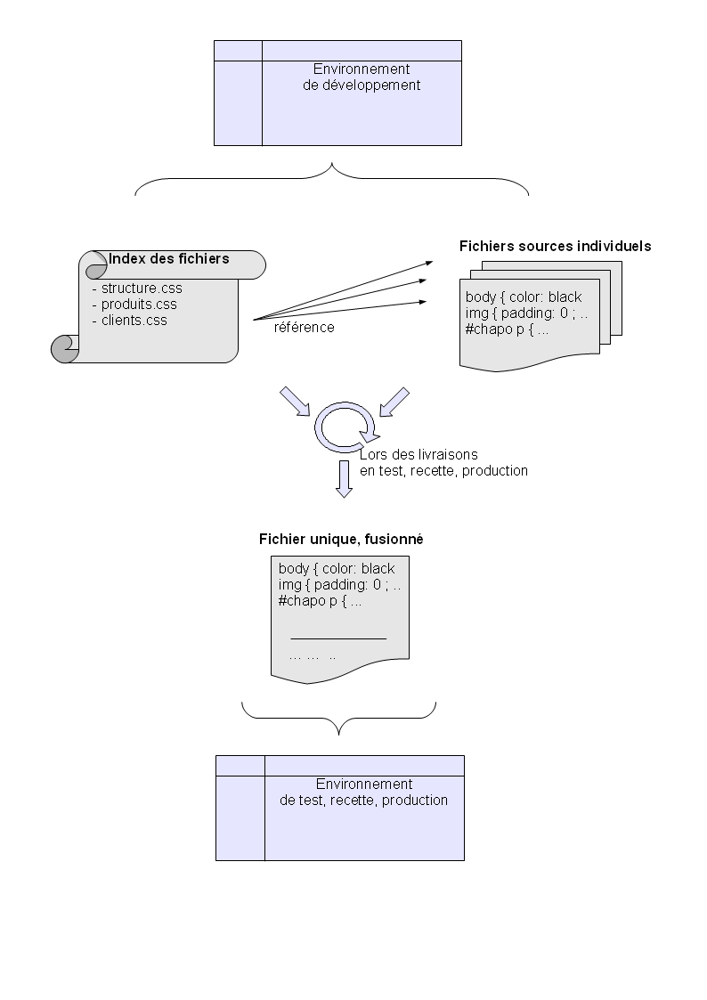

Une procédure automatisée relit cette même configuration pour 
recréer le fichier fusionné à partir des sources, par exemple 
lors de la livraison en environnement de test (mais ce peut être 
plus fréquent). Les environnements de test, recette et production 
n'ont plus qu'à faire référence à ce dernier. En général on profite 
de cette étape pour réaliser d'autres optimisations en même 
temps que la fusion, par exemple une minification des contenus 
(nous en parlerons plus loin dans ce livre). 

De nombreux composants PHP proposent d'automatiser ainsi le 
mécanisme de fusion (par exemple le plugin sfConbine pour le 
framework PHP Symfony : http://www.symfony-project.org/plugins/sfCombinePlugin). 

Une alternative intéressante est d'utiliser un module directement 
embarqué dans le serveur web. Ce dernier, qui ne prendra alors 
quasiment pas de ressources supplémentaires, se charge de faire 
la fusion dynamiquement, à la demande. On utilise une adresse 
web spécifique, à convenir, qui contient le nom de tous les fichiers. 
Le serveur web reconnaît cette adresse spécifique et s'occupe 
de fusionner à la demande tous les fichiers nécessaires avant 
de renvoyer le résultat, en faisant attention aux caches HTTP 
et aux dates de dernière modification des contenus. 

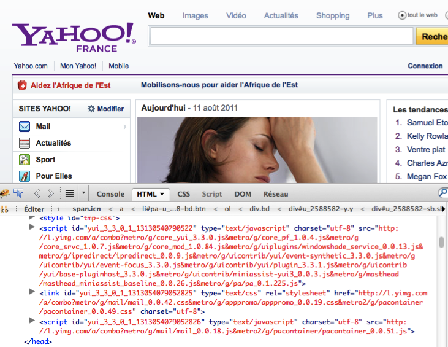

Le mod_concat est un exemple d'implémentation de ce mécanisme 
pour le serveur web Apache. Une page avec une adresse qui finit 
par un double point d'interrogation et une liste de fichiers 
séparés par des virgules chargera en une seule requête le contenu 
des différents fichiers en renvoyant la date de modification 
du fichier le plus récent. Un module similaire existe sur lighttpd. 

Yahoo! utilise lui aussi un tel mécanisme qu'ils appellent « 
combo handler » pour ses serveurs de ressources statiques. L'adresse 
suivante permet ainsi de charger en une fois le code de base de 
la bibliothèque javascript YUI et le module de gestion des cookies : 
<http://yui.yahooapis.com/combo?3.3.0/build/yui/yui-min.js&3.3.0/build/cookie/cookie-min.js>

* Pour Apache 2 : <http://code.google.com/p/modconcat/>

* Pour Lighttpd : <http://code.google.com/p/lighttpd-mod-concat/> 

* Système Yahoo! : <http://www.stevesouders.com/blog/2008/07/17/yuis-combo-handler-cdn-service/> et <http://yuiblog.com/blog/2008/10/17/loading-yui/> 

### Fichier unique ou spécifique à la page

Lors de la fusion des fichiers en un seul, il faut réfléchir si 
l'on créé un fichier spécifique à la page en cours, ou si l'on créée 
un fichier central unique à toute l'application. Il s'agit finalement 
d'un compromis entre le temps de chargement de la première page 
et la réactivité des pages suivantes : 

Avec un gros fichier unique le visiteur télécharge forcément 
une partie non négligeable de code inutile, ralentissant le 
chargement de la première page. En échange ce fichier pourra 
être stocké dans le cache HTTP une fois pour toutes, les pages 
suivantes n'auront plus besoin d'aucun téléchargement sur 
le réseau. 

À l'inverse, avec des fichiers spécifiques à chaque page le visiteur 
devra initialiser un nouveau téléchargement à chaque nouveau 
modèle de page, sans pouvoir exploiter son cache HTTP même si 
les fichiers téléchargés contiennent des parties communes. 
Le premier accès ne sera pas inutilement lent mais chaque page 
subira un ralentissement. 

Il vous faut étudier quel est le pourcentage de réutilisation 
de vos composants sur les différentes pages de votre site. Si 
la réutilisation est forte et que vous pouvez vous le permettre, 
avoir un fichier central unique pour javascript et un fichier 
central unique pour la feuille de style vous permettra d'avoir 
un site très réactif. C'est le mode que vous devriez privilégier 
dans un premier temps. 

Dans une seconde étape, il est possible de spécialiser les pages 
qui diffèrent vraiment du reste du site. Il s'agit essentiellement 
des quelques pages très riches en animation ou qui ont besoin 
de composants additionnels très lourds. On peut par exemple 
citer les pages qui contiennent des éditeurs riches en ligne 
à base de javascript. Ces pages là peuvent se permettre de ne pas 
utiliser le fichier central mais leur version, spécifique. 

Éventuellement, s'il est possible d'individualiser quelques 
modèles de pages bien spécifiques et suffisamment distincts, 
qu'il couterait trop cher de regrouper avec un fichier central, 
il est possible de réaliser un fichier par modèle de page. Ce peut 
être par exemple un fichier pour la section boutique, un pour 
la section jeux, un pour les pages de contenu, un pour les pages 
de section, etc.

Il faut toutefois garder à l'esprit que cette dernière subdivision 
diminue l'efficacité du cache puisque plus rien n'est partagé 
entre deux pages de modèle différent. Gardez à l'esprit qu'éviter 
une requête HTTP vaut généralement mieux qu'un petit renflement 
du fichier central. Tout est histoire de compromis et c'est à 
vous de tracer la ligne jaune. 

* Page classique de contenu : site.css 

* Page d'accueil : accueil.css 

* Pages boutique : boutique.css 

* Pages jeux : jeux.css 

### Quand faire plusieurs fichiers

L'étape suivante est de dégager les pages d'arrivée des visiteurs. 
Il s'agit par exemple de la page d'accueil, des pages dont l'adresse 
est dictée à la radio, à la télévision, sur des plaquettes ou publicités, 
etc. Ces pages doivent être les plus optimisées et sont souvent 
très spécifiques. Sur ces pages, et sur ces pages uniquement, 
on s'autorise à ne pas charger le fichier central mais à charger 
uniquement un fichier spécifique à la page. Le système de cache 
HTTP se mettra en œuvre uniquement si le visiteur poursuit plus 
avant dans le site. 

Enfin, si cela devient nécessaire, il est possible de diviser 
les pages du site par modèles ou par section. Il s'agit d'optimiser 
le taux de réutilisation quand celui du fichier central est mauvais. 
On construit alors un fichier central qui contient ce qui est 
commun à l'essentiel des pages et on construit quelques fichiers 
additionnels suivant les types de pages. Ainsi une page chargera 
au plus deux feuilles de style : la feuille de style centrale avec 
ce qui est utilisable partout, et une feuille spécifique à son 
modèle (par exemple la feuille de style propre à la section « boutique 
en ligne »). 

Le calibrage de cette dernière étape est délicat, il faut éviter 
de créer trop de composants différents, et s'assurer que le fichier 
central ne devient pas trop pauvre. Rappelez-vous que la multiplication 
des requêtes HTTP coute bien plus cher qu'un petit ajout dans 
le fichier central, tout est question de compromis. Si vous avez 
des doutes, rien ne vaut un petit test en production sur des échantillons 
d'utilisateurs cibles. 

* Page classique de contenu : central.css 

* Page d'accueil : accueil.css 

* Pages boutique : central.css + boutique.css 

* Pages jeux : central.css + jeux.css 

* Page référencée dans une publicité : accueil-pub.css (si 
  central.css ne convient pas) 

* Page de configuration avec des composants évolués : central.css 
  + config.css + … 

En dehors des pages spécifiques comme celles des éditeurs riches 
en javascript, il faut considérer un maximum de deux feuilles 
de style par page, en visant au maximum la possibilité de ne charger 
que le fichier central si possible. Le plus souvent, pour les 
feuilles de style, il est envisageable d'avoir un seul fichier 
central pour quasiment toutes les pages du site, sans fichier 
secondaire. 

#### Spécificités des fichiers javascript

Si ce qui a été dit reste tout à fait valable pour les fichiers javascript, 
la problématique est un peu différente. Comme les fichiers javascript 
sont parfois lourds à télécharger, l'équilibre entre un cache 
efficace, un téléchargement initial léger et le nombre de requêtes 
HTTP sera différent de celui des feuilles de style. On tendra 
à accepter plus facilement d'avoir deux voire trois fichiers 
par page (mais pas plus, et uniquement si on en a vraiment besoin). 

Il est en effet plus fréquent d'avoir besoin d'un composant spécifique 
qui sera un peu gros pour une inclusion inconditionnelle dans 
toutes les pages. Suivant les besoins on peut même aller jusqu'à 
trois fichiers javascript : le fichier central du site, le fichier 
qui contient les composants propres à la section (boutique, 
actus, etc.), et le fichier qui contient les composants spécifique 
à la page ou au modèle de page. 

Il ne faut cependant pas oublier que cette multiplication a un 
coût sérieux et qu'avoir un seul fichier par page doit rester 
un objectif à tout moment. Tout ce qui a été dit au sujet de la fusion 
des feuilles de style reste valable pour les fichiers javascript. 

Enfin, n'hésitez pas à créer un dernier fichier javascript si 
celui-ci est chargé en fin de page HTML, juste avant la fermeture 
de la balise `<body>`. Ce code ne sera en effet chargé qu'à la fin 
de la page, après tout le contenu. L'effet négatif étant plus 
faible, tout ce qui est ainsi posé à la fin a bien moins d'influence. 
Vous verrez plus loin dans ce livre qu'insérer ainsi un fichier 
javascript en fin de page est de toutes façons une recommandation 
importante. On y transférera le maximum de code possible, diminuant 
ainsi les fichiers javascript chargés en haut de page dont nous 
parlions plus tôt. 

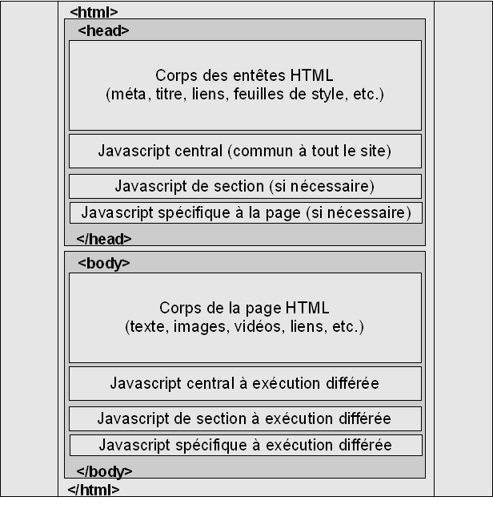

Images en sprites CSS
---------------------

Une fois les feuilles de styles et fichiers javascript concaténés 
il reste un composant principal qui occupe souvent plus de la 
moitié des requêtes HTTP : les images. Contrairement à ce que 
nous dit l'intuition, fusionner plusieurs images en un seul 
fichier est relativement courant. C'était même une pratique 
quasi systématique sur les jeux et autres applications locales 
quand nos micro-ordinateurs avaient moins de puissance et d'espace 
disque. 

Sur ces anciens jeux on parlait de sprites. Il s'agit d'un unique 
fichier image qui contient plusieurs icônes, ou plusieurs représentation 
d'un même composant (par exemple les vues sous différents angles 
d'un même objet). On trace une sorte de quadrillage virtuel dans 
une grande image et chaque case contient une icône, une vue de 
l'objet, ou une image quelconque. Pour afficher la bonne image 
il suffit d'en connaître ses coordonnées. 

Le web est un peu comme une ancienne machine où l'accès au disque 
est très lent. Chaque appel fichier prend un temps non négligeable 
et ralentit toute l'application. Les solutions mises en œuvre 
sont donc logiquement les mêmes. 

Sur le web vous trouverez de nombreux articles sur les « sprites 
CSS ». Il ne s'agit que de cela : combiner plusieurs images référencées 
par votre feuille de style en un seul fichier. 

### Gains de performance

Combiner dix images en un seul fichier (un « sprite ») permet d'éviter 
neuf requêtes HTTP. En considérant une latence de 50 ms c'est 
quasiment une demi-seconde qui est ainsi économisée. 

Le volume de données téléchargé ne change pas, ou pas beaucoup. 
L'image fusionnée a tendance à être de poids équivalent ou légèrement 
plus léger que la somme des dix images originales. Plus les images 
de départ sont petites et similaires et plus leur fusion a tendance 
à économiser aussi sur le poids à télécharger. 

Ajouté aux gains dus à la latence ou au poids des fichiers, le visiteur 
a aussi un meilleur ressenti du chargement de la page du fait qu'il 
ne voit pas toutes les images se charger une à une. Si les icônes 
similaires et fonctionnellement proches sont regroupées dans 
un même sprite, elles s'afficheront simultanément sur la page. 

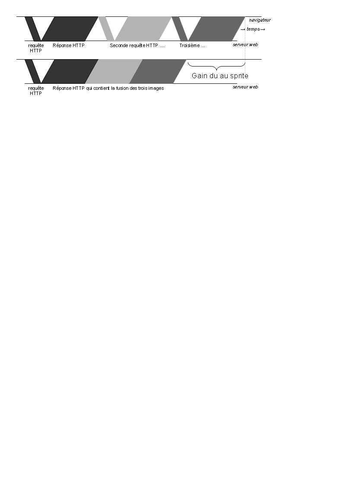

Le contre-coup est le risque de faire télécharger dans le sprite 
des images qui ne sont pas utilisées par la page courante. Dans 
ce cas, l'augmentation de volume impactera négativement la performance. 
Toutefois, par expérience, si le regroupement est fait de manière 
cohérente le gain en nombre de requêtes HTTP compense largement 
l'augmentation du poids total. Même en regroupant un fichier 
avec la centaine d'icônes du site et que seules une vingtaine 
sont utilisées par page, il est probable que le résultat soit 
positif. 

Le sprite peut aussi être extrêmement intéressant pour les autres pages 
du site puisque le sprite sera alors en cache dans le navigateur 
et que les futures pages ne nécessiteront aucun téléchargement. 

**Recommandation** : Regroupez vos images de décoration liée 
par la feuille de style en quelques grosses images (sprites) 
et utilisez les règles CSS pour afficher uniquement la partie 
que vous souhaitez. 

### Mise en œuvre

La mise en œuvre du sprite lui-même est assez simple. Il suffit 
de copier les différentes images dans une plus grande et de les 
positionner sur une grille. À peu près tous les éditeurs d'images 
permettront de faire cette opération. La seule difficulté est 
de faire attention à respecter la grille pour faciliter ensuite 
les saisies dans la feuille de style. 

L'affichage d'une image spécifique se fait un peu comme la vision 
d'une photo au travers d'un masque. Au travers du masque on ne 
voit qu'une partie restreinte de la photo. Pour visualiser un 
autre détail on peut positionner la photo sous le masque afin 
que la partie souhaitée soit visible. 

#### Position du sprite

Le procédé est exactement le même avec CSS. Imaginons que nous 
manipulions un cadre de 10 pixels sur 10 pixels (la taille d'une 
icône), nous allons positionner l'image de fond dans la feuille 
de style à l'aide de l'instruction `background-position`. 
Il faudra le plus souvent faire correspondre le cadre avec une 
partie au milieu de l'image, et donc positionner le coin en haut 
à droite de l'image plusieurs pixels avant le coin en haut à droite 
du cadre visible dans la page. La conséquence est que le plus souvent 
les mesures sont négatives : 

Nous pourrions donc avoir un code CSS similaire à : 

~~~~~~~ {.css}
div#boite {
    background-image: url(sprite.png) ;
    background-repeat: no-repeat ;
    background-position: -20px -20px ;
    width: 10px ;
    height: 10px ;
}
~~~~~~~

#### Marges

Les choses sont assez simples dans l'exemple précédent parce 
que le cadre qui contient l'image de fond a la même taille que l'image 
à y positionner. Si le cadre est plus grand, en largeur ou en hauteur, 
il faudra placer des marges vides autour de l'icône à afficher 
pour que nous n'affichions pas aussi les images à droites et en 
bas de celle que nous avons choisi. 

Si la taille est inconnue en largeur, il faudra que l'icône à positionner 
soit dernière, première, seule sur sa ligne (suivant si l'icône 
à positionner doit être affichée à gauche, à droite, ou au milieu), 
ou du moins avec une marge suffisamment grande. La problématique 
est similaire en hauteur avec les colonnes. 

Il vous faut aussi penser à prévoir une marge suffisante pour 
les différents cas : Par exemple, si la taille de l'écran est moins grande
que chez vous votre cadre s'affichera peut être plus étroit, 
et donc plus long que chez vous. De même, si l'utilisateur a agrandi 
ses polices de caractères le texte prendra plus de place, en largeur 
ou en hauteur. Votre marge doit prendre en compte ces possibilités 
pour que jamais votre sprite n'affiche plus d'images qu'il n'est 
prévu. 

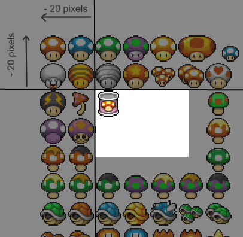

#### Répétition des images

La problématique des marges se fait d'autant plus visible quand 
une image doit être répétée horizontalement (en x) ou verticalement 
(en y). Dans ce cas il faut que le morceau d'image à afficher soit 
seule sur sa ligne (ou sur sa colonne) sans marge sur cette ligne. 

À cause de cette problématique, et parce que ces images sont généralement 
très étroites (ou très petites en hauteur), on sépare souvent 
ces images dans des sprites dédiés : un pour les images qui se répètent 
en hauteur, et un pour les images qui se répètent en largeur. Les 
images qui doivent se répéter sur les deux axes dans des dimensions 
inconnues ne sont pas intégrables dans des sprites. 

### Limitations

#### Marges et répétitions

Ces questions ont été traitées plus avant lors de la mise en œuvre. 

#### Volume et taille du sprite

Opera ne sait pas utiliser des positions de plus de 2042 pixels 
(négatifs ou positifs). Vous rencontrerez de toutes façons 
rarement cette limitation. Le regroupement en sprites doit 
être fait avec mesure. Si vous cumulez trop d'images dans vos 
sprites vous risquez d'avoir trop d'images inutiles pour la 
page en cours et d'augmenter inutilement le volume téléchargé 
par le navigateur. 

#### Taille mémoire

Nous avons dit que dans un sprite le poids de téléchargement des 
icônes inutiles est largement compensé par la réduction des 
requêtes HTTP. Toutefois les portions inutilisées du sprite 
ont un second effet : Pour afficher une image le navigateur la 
décompresse en mémoire. Là, un pixel utilise 4 octets, la compression 
jpeg ou png n'entre pas en compte. 

Pour un navigateur classique, tant qu'on n'exagère pas, cela 
n'a presque aucune conséquence. On évitera juste d'utiliser 
des sprites avec trop d'espace blanc inutile, ou plus de surface 
inutile que de surface utile. 

Pour les dispositifs mobiles (téléphones, tablettes) où la 
mémoire est très limitée, les parties inutilisées du sprite
peuvent, par contre, gêner la navigation. Sur ces plateformes il 
faudra faire attention à charger des petits sprites avec peu 
d'espace blanc et aucune image inutile. 

#### Images avec peu de couleurs

Ensuite vient une limitation liée aux couleurs. Si vous choisissez 
un format d'image limité en nombre de couleurs (GIF ou PNG8) vous 
risquez de dégrader la qualité globale de vos images (surtout 
les dégradés). En effet, là où chaque image avait sa propre liste 
de couleurs adaptée, dans un sprite toutes les images partageront 
le même index de couleurs. Si vous mettez ensemble une image qui 
avait 255 variantes de bleu avec une image qui avait 255 variantes 
de rouge, l'image résultante aura moitié moins de détails. Pour 
cela faites attention à ne mettre dans le même sprite que des images 
proches au niveau couleurs, ou passez l'image en PNG24. L'augmentation 
de volume sera normalement faible, et souvent compensée par 
le gain de poids du sprite. 

#### Accessibilité

On distingue généralement deux types d'usages pour les images 
sur une page web : les images de contenu et les images de décoration. 

Les images de contenu sont celles qui font partie intégrante 
de l'information transmise par la page. Leur disparition ferait 
perdre une donnée utile pour le visiteur et pas uniquement un 
enrichissement graphique ou une meilleure ergonomie. Parmi 
les images de contenu on retrouve entre autres les photos d'un 
article de presse, les diagrammes explicatifs, et les logos. 

Les images de décoration, elles, ne sont là que pour entourer 
le contenu. Elles font partie du graphisme de la page. Certaines 
sont là pour rendre le site agréable comme les différents fonds 
(de la page, du menu, etc.). D'autres sont indispensable à l'ergonomie 
ou à la compréhension du site comme les icônes, les traits de séparation, 
etc. 

En général on peut séparer les deux catégories en se posant les 
questions suivantes : L'image fait-elle perdre une information 
si je la retire ? Devrais-je en mettre une alternative texte si 
je retire l'aspect graphique du site ? L'image resterait-elle 
la même si je change totalement le graphisme du site ? 

Une image de contenu obtiendrait un « oui » à ces questions, une 
image de décoration aurait un « non ». Les premières devraient 
normalement être insérées via la balise HTML `` et les secondes 
via un `background-image` en CSS. 

Les sprites sont réservés aux images de présentation. Un navigateur 
qui ne supporte pas CSS ou un robot qui se contente de lire le contenu 
n'aura aucun problème. Ces images sont là uniquement pour l'aspect 
graphique : elles ne manqueront pas si elles sont omises et elles 
n'ont aucune valeur prises hors contexte. 

À l'inverse, une image de contenu ne devrait pas être insérée 
via CSS et encore moins être mise en sprite. Omise (par exemple 
par un support partiel de CSS sur le navigateur) elle provoquera 
un manque d'information, et pris hors contexte le sprite n'a 
plus aucun sens (on ne sait pas quelle partie de l'image se réfère 
à quoi). 

### Avenir et nouvelles fonctionnalités des navigateurs

Les dernières avancées CSS des navigateurs laissent espérer 
qu'on pourra faire sauter rapidement les problèmes liés aux 
marges et aux répétitions. 

Le moteur Gecko de Mozilla (qui équipe entre autres le navigateur 
Firefox) contient déjà une valeur `-moz-image-rect` qui permet 
de déterminer quelle est la partie de l'image qui sera affichée 
: plus besoin de marges et plus aucun risque d'afficher plus que 
prévu en cas de répétition. 

Ainsi l'instruction suivante permet, avec Gecko, de n'afficher 
que l'icône de dix pixels aux coordonnées 50,60 par rapport au 
coin en haut à gauche (on donne l'adresse du sprite, puis les coins 
en haut à gauche et en bas à droite) : 

~~~~~~~ {.css .online}
background-image:-moz-image-rect('sprite.png',50px,60px,60px,70px); 
~~~~~~~

Le moteur webkit (sur lequel est basé Safari) contient lui un 
`-webkit-mask-image` qui, bien qu'il ne soit pas là pour ça, 
pourrait être détourné pour faire sauter les limitations de 
marge (mais pas celles de répétition). 

Le groupe de travail CSS 3 au W3C (l'organisme qui s'occupe de 
la standardisation du langage) réfléchit aussi aux futures 
syntaxes pour gérer efficacement les sprites. Pour l'instant 
plusieurs syntaxes ont été évoquées (`@sprite`, `sprite()`, 
`image-slice()`, etc.) mais rien n'est vraiment défini. 

Le mécanisme des sprites devenant de plus en plus répandu on peut 
toutefois imaginer que les navigateurs se mettent rapidement 
d'accord pour supporter une syntaxe similaire. D'ici un an au 
plus, si vous pouvez vous passer des anciens navigateurs, il 
est probable que les limitations de marge et de répétition ne 
soient plus qu'un lointain souvenir. 

### Les outils automatiques

De nombreux outils automatiques existent pour créer des sprites. 
La première catégorie regroupe tous ceux qui analysent une page 
web et construisent d'eux même les fichiers images en vous proposant 
les modifications de CSS à réaliser. Ces outils posent généralement 
plus de problèmes qu'ils n'en résolvent parce qu'ils ne savent 
pas gérer les limitations de marge. Ils ne savent pas non plus 
regrouper correctement les images fonctionnellement proches 
ou qui se retrouvent sur des pages différentes (mais qui ont un 
intérêt à partager le même sprite). Vous pouvez par exemple essayer 
[Sprite Me](http://spriteme.org/), 
et [Spritemapper](http://yostudios.github.com/Spritemapper/) 
pour cet usage. 

Une seconde catégorie d'outils est un peu plus évoluée. Elle 
se base sur vos propres préconisations via un pseudo-langage 
propriétaire dans la feuille de style. En face d'une image vous 
pouvez ajouter un commentaire puis donner le nom d'un sprite 
et éventuellement des options (sprite vertical, horizontal, 
marges, etc.). En développement la feuille de style est directement 
utilisable, sans sprites. Lors de la mise en recette l'outil 
analyse la feuille de style, créé les sprites suivant vos propres 
regroupements et vos options, puis modifie la feuille de style. 

Cela demande une discipline pour le développeur qui doit penser 
à ajouter du code en commentaire dans sa feuille de style, mais 
offre assez de souplesse. Du fait des options les problèmes de 
marges et de répétitions sont limités, ou au moins ils sont de 
la faute du développeur (et pas celle de l'outil). L'outil le 
plus connu à ce niveau est [Smart Sprites](https://github.com/carrotsearch/smartsprites). 

Enfin, vous trouverez aussi des scripts ou des pages web qui vous 
proposeront de construire un sprite et une liste de règles CSS 
à partir des options et de la liste d'images que vous leur donnerez. 
C'est ici à vous de faire l'intégration, seul le travail frustrant 
est automatisé (constitution de l'image et écriture des lignes 
CSS pour chaque image). On peut citer le [CSS sprite generator](http://spritegen.website-performance.org/) dans cette catégorie. 

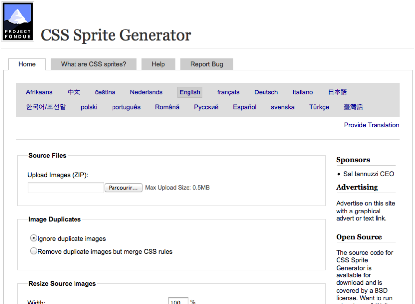

Si la première catégorie d'outils est à éviter, tous ces outils 
partagent en plus un défaut : en créant automatiquement l'image 
de sprite vous n'aurez plus la main sur les réglages fins de l'image 
(gestion de la transparence, indexation intelligente des couleurs, 
etc.). Si vous souhaitez des images avec un poids le plus faible 
possible et une qualité sans défaut, seul un graphiste pourra 
vous produire l'image, à la main. Ces outils ne pourront vous 
proposer que ces images en pleines couleurs ou des images avec 
un choix de couleur peu performant. 

Si vous choisissez de faire le travail majoritairement à la main, 
l'outil [Sprite Cow](http://www.spritecow.com/) 
peut vous faciliter énormément le travail de détourage et de 
sélection des coordonnées à l'intérieur d'un sprite. Il vous 
permet de cliquer sur une icône d'un sprite et trouvera tout seul 
les contours de l'icône et les coordonnées CSS associées. 

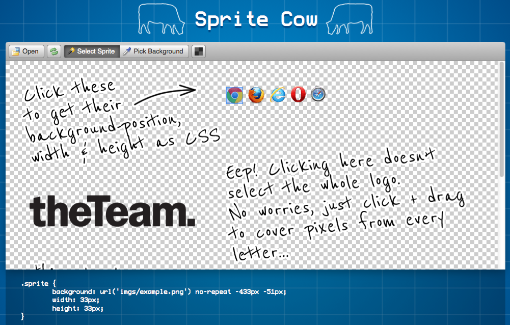

Données en ligne et téléchargements par lot
-------------------------------------------

Nous avons vu comment regrouper plusieurs composants externes 
en un seul, que nous parlions de feuille de style, javascript 
ou d'image. Si vous voulez aller plus loin il faudrait embarquer 
ces composants directement dans la page web, ou du moins les fusionner 
entre eux. 

### Externalisation des contenus

Quand nous parlions de cache dans le chapitre précédent j'avais 
posé comme recommandation d'insérer tous les codes css et javascript 
dans des fichiers externes pour qu'ils puissent utiliser le 
cache. Nous allons désormais modérer cette recommandation. 

Pour les pages d'accueil et pour les pages d'entrées du visiteur 
(par exemple la page nommée dans une publicité ou une plaquette),
la problématique est parfois un peu particulière. Ce sont les 
pages qui vont faire que le visiteur approfondira ses recherches 
ou pas, la vitesse est critique. Quelques dixièmes de secondes 
peuvent faire basculer votre taux de transformation. De plus, 
sur ces pages, le cache n'est pas le critère le plus important. 
Les internautes venant par définition d'un site tiers, et n'étant 
souvent pas des habitués, vos ressources ne seront pas encore 
en cache. 

Dans ce cas, le surcoût dû aux requêtes HTTP en plus n'est pas forcément 
compensé par le gain dû aux caches. On s'autorise alors à mettre 
le plus de contenus possible dans la page web elle-même, et à insérer 
directement les codes javascript et CSS au lieu de faire des fichiers 
externes. 

**Recommandation** : Pour les pages cibles (page d'accueil, 
publicité, plaquette) attirant essentiellement des nouveaux 
utilisateurs et suffisamment différentes du reste du site, 
envisagez d'intégrer directement les codes javascript et CSS 
dans le corps de la page HTML au lieu de fichiers externes. 

Ceci est une exception aux recommandations générales qui proposent 
l'externalisation des contenus pour profiter des caches HTTP. 

La question se pose aussi pour les images et les autres types de 
contenu. En effet, toute personne qui télécharge une image de 
fond déclarée en CSS devra avoir charger la feuille de style auparavant. 
Inversement, il existe une série d'images qui seront quasiment 
toujours chargés par les visiteurs qui chargeront la feuille 
de style. Ces images là pourraient avoir un avantage à être intégrées 
directement dans la feuille de style et à être téléchargées en 
un lot unique, ensemble. C'est ce qui est discuté ci-après. 

### Les méthodes de téléchargement par lots

Pouvoir intégrer les fichiers javascript et les feuilles de 
style directement à la page HTML est intéressant mais pas suffisant. 
Il peut être intéressant par exemple de regrouper différents 
types de contenus, ou de les proposer au téléchargement en file 
sans subir la latence entre chaque requête. C'est ce que proposent 
les trois solutions ci-dessous. 

* Insertion d'une contenu directement dans un lien via le protocole 
  « data: » 

* Insertion d'un contenu groupé avec un autre via le format mhtml 

* Insertion d'un contenu groupé avec un autre via une archive 
  jar 

Toutes sont limitées à un ou plusieurs navigateurs. Il faudra 
composer avec les différences et proposer des alternatives 
suivant le navigateur, ce qui vous imposera plus de travail. 
En général on propose une solution basé sur les deux premières 
méthodes à l'aide de commentaires HTML conditionnels (ils ne 
sont relus que par Microsoft Internet Explorer et permettent 
de gérer une version spécifique à ce navigateur). 

Toutes ont toutefois un avantage concret : Elles permettent 
de regrouper plusieurs fichiers de type différent tout en permettant 
de les télécharger en un seul lot et de mettre ce lot en cache. 

### Les liens en data:

Les liens en « data: » viennent de la RFC 2397 de 1998. Il s'agit 
tout simplement d'embarquer le contenu directement dans un 
lien plutôt que d'avoir son adresse sur le réseau. 

Au lieu d'initier un téléchargement, le navigateur lit les données 
embarquées dans le lien comme s'il s'agissait d'un fichier. 
Le lien peut représenter une image, un fichier texte, une feuille 
de style, etc. 

#### Fonctionnement

Le prototype de ces liens est le suivant : 

~~~~~~~ {.online}
data:[<mediatype>][;base64],<data> 
~~~~~~~

La première partie est fixe, il s'agit du protocole utilisé, 
`data:`. Vient ensuite le type du contenu, par exemple `image/png` 
pour une image ou `text/css` pour une feuille de style. Ce type 
de contenu peut embarquer un paramètre spécifiant codage caractère 
dans le type mime, par exemple `text/html;charset=utf-8`. 
Enfin on insère la donnée binaire ou texte elle-même, après une 
virgule. Par défaut, ce contenu est codé comme un lien, avec %xx où xx représente 
la valeur de l'octet à insérer (%20 pour un espace par exemple). 
Si le type mime contient le paramètre `base64` (les paramètres 
sont séparés par des points virgules) alors on utilise le codage 
base64. 

Exemple avec une image insérée dans le HTML : 

~~~~~~~ {.html .partial}

~~~~~~~

#### Utilisation

Cette fonctionnalité peut avoir un intérêt quand on souhaite 
avoir un seul fichier, sans composant externe (par exemple la 
diffusion d'un CV au format HTML). Nous l'utilisons ici pour 
son effet de bord : aucune requête HTTP n'est alors générée sur 
le réseau, l'image et son fichier source sont envoyées groupés. 

Si dans le cas du fichier HTML l'effet est peu utilisé, c'est très 
intéressant dans le cadre des feuilles de style. On sait que celui 
qui chargera la feuille de style chargera systématiquement 
juste après une série d'images de fond utilisées sur quasiment 
toutes les pages du site. Ces images ne sont jamais utilisées 
en dehors de la feuille de style. Si l'un est en cache, l'autre 
le sera aussi. Pourquoi les charger séparément avec plusieurs 
requêtes HTTP ? 

On embarque alors certaines séries d'images de fond (puces, 
dégradés, icônes) directement dans la feuille de style en utilisant 
ces liens en « data: » plutôt qu'en référençant de vrais fichiers 
sur le réseau. Si le poids de la feuille de style va augmenter fortement 
on aura toutefois fait moins de requêtes, et chargé plus rapidement 
la page. Le pari est que l'augmentation en volume total (30 % de 
plus pour les images intégrées ainsi) est compensé par le gain 
la diminution du nombre de requêtes. Pour des petites images 
(moins de 3 ko) c'est quasiment toujours le cas. 

S'il est possible de générer ces liens soit même, ils sont généralement 
créés par un scripts, par exemple par la fonction `base64_encode()` 
de PHP : 

~~~~~~~ {.php}
<?php
function lien_data($type, $fichier) {
   $data = file_gets_content( $fichier ) ;
   $base64 = base64_encode($data) ;
   return "data:$type;base64,$base64" ;
}
~~~~~~~

Google embarque aussi quelques images de contenu directement 
dans la page HTML : les vignettes de fichiers vidéos dans les résultats 
de recherche. Il s'agit d'images qui n'ont de sens que pour la 
requête courante (donc qui ne peuvent profiter du cache) et dont 
on veut éviter qu'elle apparaissent au fur et à mesure dans la 
page. 

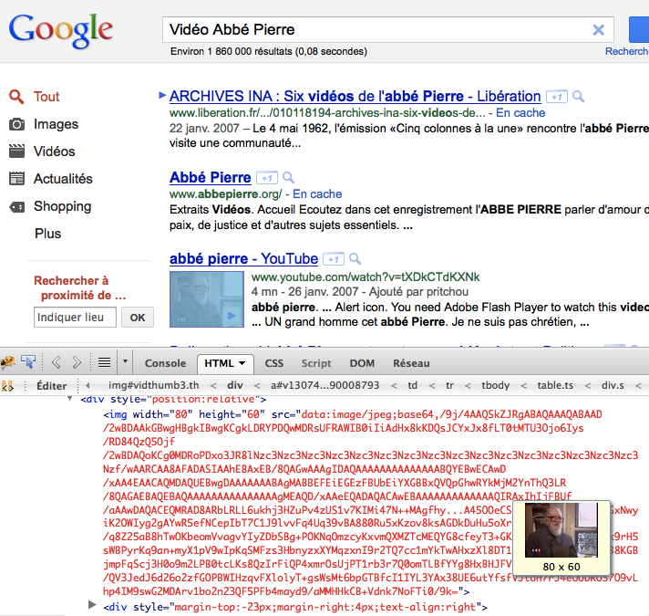

#### Limitations

Cette procédure demande toutefois quelques précautions. Tout 
d'abord il faut faire très attention à ne spécifier l'image que 
dans une seule règle CSS. Si besoin on peut construire un sélecteur 
complexe ou les mutualiser (plusieurs sélecteurs séparés par 
des virgules, pour un bloc de règles CSS). Si on répète plusieurs 
fois le lien c'est plusieurs fois qu'il faudra embarquer l'image 
dans la feuille de style et le poids total de cette dernière va 
exploser. 

Il faudra aussi faire attention à la compatibilité. Si quasiment 
tous les navigateurs supportent cette syntaxe dans leur dernière 
version, Microsoft Internet Explorer ne le permettait pas dans 
ses versions 6 et 7, qui sont encore assez répandues. Si vous utilisez 
un site web public, vous devrez peut être proposer des alternatives 
à ces deux versions. Une possibilité est de proposer une feuille 
de style additionnelle ou alternative spécifique à Internet 
Explorer 6 et 7 qui elle va utiliser des fichiers traditionnels, 
ou une autre méthode (par exemple les compositions mhtml vues 
juste après). Cela demande toutefois de maintenir deux versions 
de la même CSS, et donc des difficultés supplémentaires. 

C'est aussi pour cela qu'il faut autant que possible se limiter 
aux images de décoration insérées dans les feuilles de style. 
Utiliser les liens en data: pour des composants qui ont du sens 
par rapport au contenu (schéma illustratifs par exemple) risquerait 
de poser des problèmes à de nombreux lecteurs ou aux robots (indexation, 
aide à la compréhension, outils d'accessibilité, etc.). 

### Les fichiers composés mhtml

Les fichiers mhtml viennent du monde des emails (le nom vient 
de « mime html », mime venant lui-même de « multipurpose internet 
mail extensions », pour « extensions multifonctions pour e-mails 
internet). Ils y servent à insérer des images jointes au mail 
et y faire référence dans le corps du document (généralement 
du HTML). 

Ce concept, défini par la RFC 2557, a récemment été réutilisé 
par les équipes de performance web pour compenser le manque de 
liens en data: par Microsoft Internet Explorer 6 et 7. On le trouve 
aussi parfois sous le nom de MHT. Certains fichiers réalisés 
ainsi utilisent l'extension .mht. 

#### Fonctionnement

Le fichier mhtml doit être envoyé avec une entête `Content-Type` 
spécifique, `message/rfc822`. 

L'interne des fichiers est exactement le même que l'enveloppe 
d'un e-mail. Le contenu principal prend un type mime spécifique 
(`multipart/related`, qui est différent du type mime avec lequel 
est envoyé le fichier mhtml lui-même) et on utilise des séparateurs 
(« boundary ») pour diviser le message en plusieurs sous contenus. 
Chaque sous contenu a ensuite ses propres entêtes avec son type 
mime. 

Exemple de fichier MHTML (notez bien la présence d'entêtes et 
les différents blocs de contenu et la présence des deux tirets 
finaux) : 

~~~~~~~ {.email .mime}
From: eric.daspet@example.org
Subject: Exemple de mhtml
MIME-Version: 1.0
Content-Type: multipart/related ;
              boundary="==boundary-1" ;
              type="text/html"

<!doctype html>
<html>
<head>
<title>Test de puce rouge</title>
<link rel="stylesheet" href="mhtml:http://...fichier.html!st.css">
</head>
<body>

Exemple de puce rouge : 

</body>
</html>

--==boundary-1
Content-Type: text/css
Content-Location: st.css

img { border: 1px solid black ; }

--==boundary-1
Content-Type: image/png
Content-Location: puce-rouge.png
Content-Transfer-Encoding: base64

iVBORw0KGgoAAAANSUhEUgAAAAoAAAAKCAYAAACNMs+9AAAABGdBTUEAALGP
C/xhBQAAAAlwSFlzAAALEwAACxMBAJqcGAAAAAd0SU1FB9YGARc5KB0XV+IA
AAAddEVYdENvbW1lbnQAQ3JlYXRlZCB3aXRoIFRoZSBHSU1Q72QlbgAAAF1J
REFUGNO9zL0NglAAxPEfdLTs4BZM4DIO4C7OwQg2JoQ9LE1exdlYvBBeZ7jq
ch9//q1uH4TLzw4d6+ErXMMcXuHWxId3KOETnnXXV6MJpcq2MLaI97CER3N0
vr4MkhoXe0rZigAAAABJRU5ErkJggg==
--==boundary-1--
~~~~~~~

Pour référencer un contenu (identifié grâce à l'entête `Content-Location` 
dans le fichier mhtml) on utilise un lien de type suivant : 

~~~~~~~ {.oneline}
mhtml:adresse_du_fichier!identifiant_dans_le_fichier
~~~~~~~

Si tous les composants référencés et le code qui les référence 
sont dans le même fichier mhtml, il est aussi possible, voire 
préférable, de référencer tous les composants (même le principal) 
par leur URL réelle complète. Le navigateur sait alors résoudre 
les liens relatifs ou absolus classiques, et prendre le contenu 
dans le fichier mhtml s'il y est présent, ou aller le chercher 
sur le réseau sinon. 

#### Utilisation

Les cas d'utilisation des fichiers mhtml sont globalement les 
mêmes que les URLs en data:. Le système peut même sembler plus 
propre du fait qu'on sépare bien les différents contenus dans 
des blocs distincts. 

Comme désormais les dernières versions de Microsoft Internet 
Explorer supportent les adresses en data:, l'utilisation des 
fichiers mhtml devient anecdotique sur le web. 

#### Limitations

Les limitations sont elles aussi similaires aux URLs en data:. 
Ici toutefois seul Microsoft Internet Explorer et Opera depuis 
sa version 9 savent relire ces contenus. C'est d'ailleurs la 
seule alternative viable pour les premiers. 

Pour Mozilla Firefox, il est toutefois possible d'ajouter le 
support des mhtml via une extension. Les extensions « Mozilla 
Archive Format » (maf) ou « unMHT » permettent cela. Elles sont 
toutes les deux téléchargeables depuis le dépôt officiel des 
extensions Firefox. 

La faible compatibilité des fichiers mhtml les limite à des intranets 
où on contrôle les navigateurs web et leurs versions, ou comme 
alternative aux URL en data: pour les vieilles versions d'Internet 
Explorer. 

À l'aide de commentaires et de hacks CSS, certains ont réussi à 
faire interpréter un même fichier avec des liens en data: pour 
ceux qui le supportent, et des composants intégrés en mhtml pour 
les vieilles versions de Internet Explorer. Cette technique 
vous impose toutefois d'insérer deux fois en base64 le contenu 
de chaque image embarquée, et donc de doubler le poids de ces images 
pour le navigateur. Je préfère charger une feuille de style dédiée 
suivant le navigateur, par exemple à l'aide de commentaires 
conditionnels HTML. 

### Les archives jar

Les archives jar ne sont supportées que par les navigateurs basés 
sur Gecko (dont Mozilla Firefox). Il s'agit, comme pour les fichiers 
mhtml, d'embarquer plusieurs contenus en un fichier unique 
et de pouvoir les référencer individuellement par la suite. 

Ici, au lieu d'utiliser le format des pièces jointes e-mail, 
on réutilise le système des archives zip. Il suffit d'insérer 
tous vos fichiers dans une archive zip et de la distribuer avec 
le type `application/java-archive` ou `application/x-jar`. 
Généralement on utilise l'extension .jar plutôt que .zip, mais 
cela n'a aucune influence réelle. 

On peut ensuite référencer les documents avec une syntaxe quasiment 
identique à celle des fichiers mhtml : 

~~~~~~~ {.oneline}
jar:adresse_du_fichier_jar!adresse_dans_le_fichier_jar
~~~~~~~

Les utilisations et les limitations sont en tout point similaires 
à celles des fichiers mhtml. La seule différence est le support 
de Mozilla Firefox plutôt que Microsoft Internet Explorer et 
le fait que le fichier puisse être initialement compressé (mais 
HTTP peut compresser après coup les fichiers mhtml lors du transfert, 
donc ce n'est pas un critère différenciant). 

### Quand et quoi mettre « en ligne » ou par lot

Les données « en ligne » devraient être réservées aux pages d'accueil, 
aux pages d'arrivées spéciales (celles nommées dans une publicité, 
dans une plaquette). Dans ces cas l'idée est de convaincre l'utilisateur 
de continuer sur le site en lui donnant la meilleure expérience 
possible pour sa première page (sur laquelle on ne reviendra 
probablement pas), quitte à ralentir un peu le chargement de 
la seconde page (vu que le cache ne sera pas initialisé). Plus 
la page est spéciale, et uniquement utilisée comme page d'arrivée 
(et pas dans la suite de la navigation), plus la décision d'embarquer 
javascript, CSS, voire images et autres composants en ligne 
à du sens. 

Pour les téléchargements par lot via data:, mhtml ou jar les critères 
sont un peu plus souples. Il est en effet possible de profiter 
du cache quand les fichiers sont chargés en lot avec une feuille 
de style ou un javascript externe (et pas directement avec la 
page principale elle-même). Il n'y a que trois problématiques 
qui doivent alors guider le choix : 

* limiter la présence dans le lot de composants qui sont inutiles 
  pour la page en cours (et encore plus s'ils sont aussi potentiellement 
  inutiles dans les futures pages visitées) ; 

* ne pas tout mettre en un seul fichier mais faire en sorte que 
  la page ait au moins deux ou trois lots ou composants différents 
  de taille similaire (afin d'optimiser les capacité de téléchargement 
  parallèle des navigateurs) ; 

* ne pas charger un composant en lot avec un contenu principal 
  (CSS ou js) si ce composant est aussi utilisé ailleurs sans 
  ce contenu principal (sinon on va de toutes façons devoir le 
  recharger indépendamment et on l'aura téléchargé deux fois 
  au final). 

Globalement, si deux contenus sont toujours utilisés ensemble, 
les charger en un seul lot a presque toujours du sens. C'est par 
exemple le cas pour des images de fonds ou des icônes qui sont utilisées 
sur presque toutes les pages et référencées par la feuille de 
style. Dans ce cas les embarquer directement dans la feuille 
de style à l'aide de liens en data: ou mhtml est une bonne idée. 

Il reste que du fait de la complexité de mise en œuvre (devoir gérer 
mhtml et data: suivant le navigateur en proposant les deux) et 
du coût de maintenance associé, il faut vraiment restreindre 
ces solutions aux cas où le gain est assuré. 

**Recommandation** : Les images de décoration utiles sur la 
grande majorité des pages peuvent être intégrées directement 
dans la feuille de style à l'aide des procédés data: et mhtml. 

Pour servir le bon type de contenu à chaque navigateur, on peut,
par exemple, utiliser des commentaires conditionnels HTML (et 
donc des feuilles de style différentes). 

Repérer les requêtes HTTP inutiles
----------------------------------

Nous avons tenté de limiter les requêtes HTTP sur les contenus 
principaux, en regroupant les feuilles de style et les fichiers 
javascript entre eux, en regroupant les images en sprites, voire 
en proposant de télécharger les images directement avec la feuille 
de style. 

Il faut ensuite faire la chasse à toutes les requêtes HTTP qui 
pourraient être inutiles. On en identifie habituellement trois 
types : les redirections, les feuilles de style alternatives, 
et les images de gradients ou de coins arrondis. 

### Redirections

Les redirections sont les premiers candidats à l'élimination. On 
voit beaucoup de redirections sur les sites d'entreprise. La 
saisie de [http://example.org/](http://example.org/) nous 
renvoie vers [http://www.example.org/](http://www.example.org/) 
qui nous renvoie ensuite vers [http://www.example.org/index.html](http://www.example.org/) 
qui renvoie parfois à son tour vers [http://www.example.org/welcome/](http://www.example.org/welcome/). 
Si cet exemple fictif vous paraît un peu exagéré, sachez qu'il 
n'en est rien et qu'il n'est pas rare de voir quatre ou cinq redirections 
consécutives. 

Chaque redirection est un aller-retour entre le navigateur 
et le serveur. Si l'aller-retour est assez souvent rapide, quand 
on en enchaîne trois ou quatre, cela devient non négligeable. 
C'est d'autant plus vrai si la redirection concerne la page HTML 
elle-même puisque c'est tout l'affichage qui est mis en attente 
le temps de résoudre la redirection. 

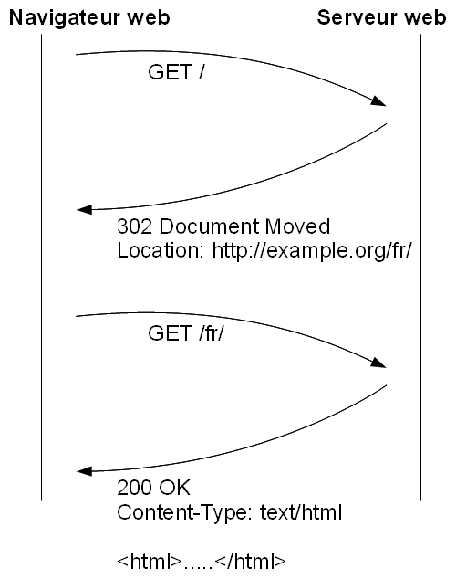

La solution serait de supprimer les redirections, afficher 
directement le bon contenu lors du premier accès. Un compromis 
acceptable pourrait être de au moins faire en sorte que la première 
redirection nous emmène directement à la destination finale 
sans les étapes intermédiaire. 

**Recommandation** : Évitez les redirections, ou restreignez-les 
pour ne jamais les empiler les unes après les autres. 

S'il faut faire une redirection le problème peut être encore 
plus important si vous la réalisez à l'aide d'une balise `<meta>` 
en HTML ou pire, avec un code javascript` document.location`. 
Dans ces deux cas le navigateur tente de charger la page HTML complète 
avec images, javascript, feuilles de style. C'est parfois plusieurs 
dizaines de requêtes qui sont lancées avant de faire la redirection. 
C'est donc autant de temps perdu, inutilement. 

Si redirection il doit y avoir elle doit être faite directement 
en HTTP (on utilise un code de retour spécial, qui peut être 301, 
302 ou 307). Le navigateur et le serveur web se comprennent alors 
immédiatement sans besoin pour le premier de télécharger une 
lourde page HTML bourrée de composants. 

**Recommandation** : Les éventuelles redirections doivent 
être réalisées avec un code de retour HTTP 301, 302 ou 307 et pas 
à l'aide d'une balise HTML ou d'un code javascript. 

### Feuilles de style alternatives

Les pages web permettent de saisir plusieurs feuilles de style, 
certaines destinées à la présentation écran, d'autres à la présentation 
papier ou pour les appareils mobiles. On s'en sert par exemple 
pour masquer les menus de navigation à l'impression, ou pour 
donner une allure plus classique à une impression papier. Le 
navigateur se charge alors de prendre la feuille de style qui 
est adapté à son cas et d'ignorer les autres. 

Malheureusement, certains navigateurs téléchargent toutes 
ces feuilles de style, même quand ils ne s'en servent pas. Dès 
lors, il est important de ne proposer que les feuilles de style 
qui sont vraiment utiles et de ne pas les multiplier « au cas où 
». 

**Recommandation** : Ne proposer des feuilles de style pour 
des médias spécifiques qu'en cas de besoin. Vous éviterez d'ajouter 
des téléchargements inutiles pour certains navigateurs. 

Si plusieurs styles sont nécessaires, il est aussi recommandés 
de les regrouper dans le même fichier (impression et écran dans 
le même fichier) plutôt que de faire un fichier CSS par type d'application 
(impression et écran dans des fichiers séparés). On évite au 
navigateur de faire une requête supplémentaire inutilement 
vu qu'il va de toutes façons télécharger les deux. 

**Recommandation** : Insérer les styles destinés aux différents 
médias dans le même fichier CSS plutôt que dans des fichiers dédiés 
à chaque fois. 

Il est aussi possible de déclarer plusieurs styles pour la page. 
L'un sera le style par défaut, les autres seront des styles alternatifs, 
qui pourront être chargés sur demande de l'utilisateur. On s'en 
sert par exemple pour fournir des versions adaptées aux mal-voyants, 
ou pour proposer une version à contraste inversé (texte clair 
sur fond sombre). 

Là aussi certains navigateurs chargent tous ces styles par défaut 
bien qu'ils n'en utilisent qu'un seul à la fois. Ils le font pour 
pouvoir basculer rapidement de l'un à l'autre, mais du coup ils 
ralentissent le chargement de la page principale, ce qui est 
rarement une bonne idée. 

**Recommandation** : Ne spécifiez pas de style alternatif dans 
la page HTML. Si vous devez proposer plusieurs styles, reposez-vous 
sur un mécanisme à base de javascript ou via un fonctionnement 
applicatif côté serveur (le serveur se chargera d'envoyer la 
feuille de style adaptée et seulement celle là). 

### Bug CSS Android

Android, au moins jusqu'à sa version 2.3, hérite d'un [ancien 
bug du moteur Webkit](https://bugs.webkit.org/show_bug.cgi?id=24223). 
Ce dernier télécharge toutes les ressources liées par vos feuilles 
de style et applicables à votre contenu HTML. 

Normalement le navigateur gère les priorités et les redéfinitions 
dans les feuilles de style. Si j'ajoute une image de fond rouge 
à tous les paragraphes, un verte aux paragraphes d'introduction 
et une bleue quand l'écran fait moins de 600 pixels, le navigateur 
sait faire le tri et n'en télécharger qu'une seule : celle qu'il 
affichera réellement. Android n'a pas ce comportement astucieux 
et téléchargera les trois images quoi qu'il en soit. Le navigateur 
risque donc de télécharger beaucoup d'images inutiles, et de 
ralentir d'autant le chargement complet de la page. 

**Recommandation** : Ne vous reposez pas trop sur la cascade 
CSS. Faites en sorte que pour chaque balise HTML seule une image 
de fond soit applicable dans les feuilles de style. 

### Coins arrondis

Dans les mises en page riches, une partie non négligeable des 
images est souvent utilisée pour arrondir les angles des cadres. 
Les blocs rectangulaires purs et durs sont vus comme agressifs 
et « vieux » par certains graphistes. 

La technique la plus habituelle est d'utiliser une à neuf images 
pour les coins et les bordures, et un montage peu simple en html 
et CSS pour placer ces images dans les différents coins et bords. 
Le plus souvent ce sont quatre images qui sont utilisées, ou au 
moins une grande image (sprite) de taille extrêmement importante 
au cas où le bloc s'étende sur la page. Ceci est à multiplier par 
le nombre de blocs différents à arrondir : couleur, taille, épaisseur 
de bordure, etc. 

Nous passer de ces coins arrondis peut améliorer sensiblement 
les performances, simplement grâce à la réduction de requêtes 
HTTP. C'est par exemple le choix qu'à fait Yahoo! Sport Europe. 
Si le choix a été difficile à prendre, après une phase d'acclimatation 
le design s'est trouvé tout aussi acceptable, mais avec de bien 
meilleures performances. 

Si votre graphiste est rétif à l'idée de ce genre de changement 
radical, il est heureusement possible d'envisager une autre 
solution : 

#### Utilisation de CSS 3

Le niveau 3 de la spécification CSS propose une amélioration 
que nous pouvons utiliser. Le module « Backgrounds and Borders 
» inclut en effet une propriété `border-radius` qui permet d'arrondir 
la bordure d'un bloc. Aucune image n'est alors mise en œuvre et 
le rendu sera tel qu'on l'attends : un bloc dont les bords sont 
arrondis. 

L'arrondi généré correspond à un quart d'ovale dont la distance 
entre le centre et les bords est donnée en paramètre. Il est donc 
possible de spécifier deux valeurs pour chaque coin (`border-{top|bottom}-{left|right}-radius`) 
séparées par un espace : la distance du centre de l'ovale par rapport 
au bord vertical puis la distance du centre par rapport au bord 
horizontal. Si on ne spécifie qu'une seule valeur elle servira 
pour les deux distances. 

Il est aussi possible de spécifier directement les quatre coins 
dans la directive border-radius. Il faut alors spécifier les 
distances avec les quatre bords verticaux séparés par des espaces, 
dans le même ordre que pour la propriété border, puis une barre 
oblique (_slash_) et les distances avec les quatre bords horizontaux. 

~~~~~~~ {.css}
border-radius: 55pt 55pt 55pt 55pt / 25pt 25pt 25pt 25pt ;
/* équivalent à : */
border-top-right-radius: 55pt 25pt ;
border-top-left-radius: 55pt 25pt ;
border-bottom-left-radius: 55pt 25pt ;
border-bottom-right-radius: 55pt 25pt ;
~~~~~~~

Tous les navigateurs récents acceptent ces directives CSS, 
y compris Microsoft Internet Explorer à partir de sa version 
9. Les anciens navigateurs Webkit (ce qui inclut à l'heure actuelle 
les dernières versions Iphone 4.2 et Android 2.3) nécessitent 
toutefois un préfixe `-webkit-`. Il vous suffit de préciser 
les deux versions, avec et sans préfixe, pour maximiser la compatibilité. 

~~~~~~~ {.css}
-webkit-border-radius: 55px ;
border-radius: 55px ;
~~~~~~~

**Recommandation** : Utilisez CSS 3 pour remplacer les blocs 
à coins arrondis ou formes arrondies créés à partir de fichiers 
images. 

#### Lâcher Microsoft Internet Explorer 6 à 8

Le problème restant avec la technique CSS 3 est celui des anciens 
navigateurs, et plus spécifiquement des Microsoft Internet 
Explorer 6, 7 et 8 qui ne supportent pas cette technique. 

Il y a deux solutions à envisager si ces navigateurs ne représentent 
pas votre cœur de cible. Heureusement pour nous, s'ils occupaient 
90 % du marché il y a encore peu, ce chiffre diminue chaque mois 
et tombera probablement en dessous de 50 % avant que vous ne lisiez 
ces lignes (il est d'environ 53 % lors de l'écriture). Quand Microsoft 
Internet Explorer 9 sortira, on peut facilement imaginer voir 
les parts de marché cumulées des versions 6, 7 et 8 tomber nettement 
plus bas (je voulais m'avancer à annoncer 30 % mais un relecteur 
m'a fait signe que je m'avançais un peu trop alors prenez ce nombre 
comme un pari). À l'heure où j'écris ces lignes Microsoft lui-même 
lance une opération de communication ayant pour but d'éliminer 
Internet Explorer 6 du marché et de provoquer une mise à jour. 

La première solution est celle de l'enrichissement progressif 
(ou de la dégradation acceptable, suivant le référentiel que 
vous choisissez). Il s'agit de n'appliquer les arrondis qu'aux 
navigateurs supportant CSS 3 et de considérer qu'il s'agit d'un 
enrichissement optionnel, d'un bonus. On parle souvent d'enrichissement 
progressif ou de dégradation élégante, il s'agit d'assumer 
de faire « mieux » pour certains navigateurs tant que les autres 
gardent un niveau de qualité acceptable. 

La seconde solution est d'utiliser les « hacks » CSS ou les commentaires 
conditionnels HTML pour revenir à l'ancienne méthode des coins 
arrondis à l'aide d'images pour ces vieilles versions de Microsoft 
Internet Explorer. Si cela vous paraît inacceptable de laisser 
ce défaut de performance à MSIE, dites vous bien que c'est ce que 
vous aviez jusqu'à maintenant, et qui ne vous posait pas de problème 
de conscience avant de lire ce chapitre. 

Les questions de performance sont toujours des compromis et 
une obligation de moyens. Vous pouvez faire mieux, mais si vous 
avez amélioré la situation sur ce point là pour 50 % des visiteurs 
c'est déjà pas mal non ? Les autres améliorations s'adresseront, 
elles, à tout le monde. Certaines même s'adresseront uniquement 
à Microsoft Internet Explorer, et vous aurez rétabli la balance 
sans rentrer dans des développements discutables. 

#### SVG et VML

Il nous reste encore deux solutions qui n'ont pas été abordées 
pour nos coins arrondis : utiliser des images vectorielles directement 
embarquées dans un code html ou javascript, ne nécessitant pas 
de multiples images tierces. 

Nous pouvons faire appel pour cela aux deux langages vectoriels 
utilisés sur le web : SVG et VML. Le premier, SVG, est supporté 
plus ou moins bien par tous les navigateurs récents mais souffre 
lui aussi d'un manque de support de Microsoft Internet Explorer 
6 à 8 (sauf plugin tiers à installer en plus). Il n'offre donc pas 
grand avantage par rapport à la solution en CSS 3. 

La seconde solution se base sur VML, qui est plus ou moins l'ancêtre 
de SVG tout en étant plus évolué sur de nombreux points. Ce format 
a été abandonné vers 1998 mais reste supporté et utilisé par Microsoft, 
entre autres dans son navigateur. Il est alors possible de l'utiliser 
pour créer nos coins arrondis dans Microsoft Internet Explorer, 
en parallèle de l'option CSS 3. 

Pour obtenir un bloc aux coins arrondis on utilise la balise VML 
`<roundrect>`. L'attribut `arcsize` permet de définir la profondeur 
de l'arrondi et l'attribut fillcolor la couleur de fond (mais 
des syntaxes existent pour mettre des images de fond ou des bordures 
et pas uniquement des couleurs pleines). 

Dans l'exemple suivant on commence par déclarer l'espace de 
nom VML (le préfixe utilisé par les balises VML) avant d'utiliser 
`<roundrect>` lui même. Ceux qui ont l'habitude d'utiliser 
XML doivent faire attention, la syntaxe pour déclarer l'espace 
de nom n'est pas une faute de frappe, y compris le préfixe « `xml:` 
» qui n'est lui-même pas déclaré (si cette phrase d'avertissement 
ne vous dit rien, ignorez là). 

~~~~~~~  {.xml .vml .partial}
<xml:namespace ns="urn:schemas-microsoft-com:vml" prefix="v" />
<v:roundrect arcsize=".02" fillcolor="#000">
Lorem ipsum dolor sit amet, consectetuer adipiscing
</v>
~~~~~~~

Pour que le tout fonctionne on ajoute quelques lignes à la feuille 
de style : 

~~~~~~~ {.css}
v\:roundrect {
    behavior:url(#default#VML) ;
}
~~~~~~~

Au final, si on souhaite utiliser la même balise pour tous les 
navigateurs, on peut finir avec un code similaire à celui ci : 

~~~~~~~ {.css}
v\:roundrect {
    color:#FFF ;
    display:block ;
    background-color:#000 ;
    -moz-border-radius:10px ;
    -webkit-border-radius: 10px ;
    -khtml-border-radius: 10px ;
    border-radius: 10px ;
    /* suite pour IE seulement : */
    behavior:url(#default#VML)
    /background-color:transparent ;
}
~~~~~~~

On notera l'obligation d'utiliser un « hack » CSS (la barre oblique 
inverse) pour retirer la couleur de fond dans Internet Explorer. 
Cette dernière est en effet alors précisée dans la balise VML. 
Pour Microsoft Internet Explorer 8 il faut aussi souvent ajouter 
les règles CSS `position:relative` et `z-index:0` à l'élément 
parent afin de faire fonctionner notre code VML. 

Deux projets existent afin d'améliorer la situation pour les 
intégrateurs web. Tous deux prennent en charge la création de 
l'élément VML et tout le code nécessaire pour le mettre en œuvre. 

La première s'appelle DD_Roundies. Elle vous propose de charger 
un fichier javascript spécifique avec un commentaire conditionnel 
HTML (pour ne pas l'exécuter dans les navigateurs qui n'en ont 
pas besoin) et de faire appel à la méthode `DD_Roundies.addRule()` 
pour chaque sélecteur CSS qui cible les images à coins arrondis. 

~~~~~~~ {.html .partial}
<!--[if lte IE 9]>
<![endif]-->
DD_roundies.addRule('#menu li', '10px'); 
DD_roundies.addRule('h1', '20px') ;
~~~~~~~

La seconde méthode utilise un fichier HTC (l'équivalent des 
fichiers XBL, mais propre à Microsoft Internet Explorer). Ces 
fichiers permettent de rajouter des fonctionnements complexes 
à certaines balises HTML, en javascript, dans les feuilles de 
style. Le HTC s'occupe donc de tout le code VML pour peu qu'on l'inclue 
dans tous les sélecteurs CSS qui s'occupent des coins arrondis 
: 

~~~~~~~ {.css}
.arrondi { 
    -moz-border-radius: 10px; 
    -webkit-border-radius: 10px; 
    -khtml-border-radius: 10px; 
    border-radius: 10px; 
    behavior: url(border-radius.htc); 
}
~~~~~~~

Chaque méthode a ses propres avantages. La seconde est réputée 
fonctionner avec des cas plus complexes (images de fond, bordure, 
semi-transparence, etc.) mais ne gère que les cas où les quatre 
coins sont arrondis de la même façon et peut poser des problèmes 
de performance (je ne garantis donc pas que le remède n'est pas 
pire que le mal initial, c'est à vous de le vérifier). 

* DD_Roundies : [http://dillerdesign.com/experiment/DD_roundies/](http://dillerdesign.com/experiment/DD_roundies/) 

* HTC curved corners : [http://code.google.com/p/curved-corner/](http://code.google.com/p/curved-corner/) 

Si vous décidez d'utiliser une de ces deux méthodes, relisez 
le titre précédent « Lâcher Microsoft Internet Explorer 6 à 8 
» par acquis de conscience. Il est très probable que vous vous 
engagiez sur une solution qui ne couvre pas tous les cas d'utilisation, 
qui vous ajoute des contraintes de développement, et qui a, elle 
aussi, ses défauts de performance (htc pour l'une, javascript 
pour l'autre). À vous de faire vos choix, je ne vous donne que les 
armes, mais si vous vous tirez dans le pied à ce sujet, je dégage 
toute responsabilité. 

### Dégradés

Comme pour les coins arrondis, il est possible d'utiliser CSS 
3 pour remplacer les images de dégradés. Les dégradés sont alors 
créés directement par le navigateur sans fichier ou ressource 
externe, sans perte de performance. 

C'est important car pour créer un dégradé en image de fond il faut 
parfois créer une image de taille importante, qui sera lourde 
à charger ou lourde à afficher. Cela peut aussi avantageusement 
remplacer les images de fond pour les boutons et éliminer le besoin 
pour de nombreuses images (en fonction de la taille du bouton, 
de la couleur, etc.). 

La structure est complexe afin de gérer les différents navigateurs. 
En attendant que CSS 3 soit mieux implémenté vous pouvez générer 
tout le code nécessaire à l'aide d'un outil en ligne à l'adresse 
<http://www.display-inline.fr/projects/css-gradient/>. 

#### Utilisation de CSS 3

Des directives pour créer des dégradés ont été imaginées pour 
CSS 3. Il s'agit de spécifier une couleur de départ, une couleur 
de fin, éventuellement des couleurs intermédiaires, et une 
direction. À partir de là le navigateur est capable de créer un 
dégradé en image de fond, linéaire ou radial. 

Malheureusement la syntaxe n'a pas été figée immédiatement 
et il existe encore deux implémentations existantes. 

La syntaxe amenée à être pérennisée est supportée par Mozilla 
(Firefox), Safari à partir de la version 6, Chrome à partir de 
la version 10 et Opera à partir de la version 11.1. Une ancienne 
syntaxe propre à Webkit, plus complexe, est supportée par les 
versions plus anciennes de Chrome et Safari (y compris leurs 
versions iphone 4.2 et Android 2.3). Microsoft Internet Explorer 
prévoit un support pour sa version 10. 

La première syntaxe, pérenne, est la plus simple. Pour un dégradé 
linéaire on utilise `linear-gradient` avec une position de 
départ (horizontale puis verticale) et/ou un angle, puis au 
moins deux mentions de couleur (une couleur et optionnellement 
une mesure en pourcentage ou en pixels). Le dégradé suivant a 
une direction de 90 degrés, va du blanc au rouge puis du rouge au 
noir, le rouge se situant à 70% entre le départ et la fin du dégradé 
: 

~~~~~~~ {.oneline .css}
background-image: -moz-linear-gradient(90deg, white, red 70%, black);
~~~~~~~

Pour un dégradé radial on utilise `radial-gradient` avec une 
position de départ et/ou un angle, la forme (`elipse` ou `circle`) 
avec éventuellement la taille (`closest-side`, `closest-corner`, 
`farthest-side`, `farthest-corner`, `cover` ou `contain`), 
puis une suite de mentions de couleurs (à chaque fois une couleur 
et optionnellement une mesure). 

~~~~~~~ {.css}
background-image: -moz-radial-gradient(center center, 
                      circle closest-side #aedae5, #d8edf2 50px);
~~~~~~~

Les deux propriétés peuvent être préfixées par `repeating-` 
pour demander une répétition du gradient. 

Enfin, les navigateurs actuels demandent pour l'instant un 
préfixe pour interpréter ces syntaxes : `-moz-` pour Mozilla 
(utilisé dans les exemples), et `-o-` pour Opera et `-webkit-` 
pour Webkit. Dans le futur ces préfixes sont amenés à disparaître. 

#### Support des anciens navigateurs Wekit

Pour les anciens webkit (Safari et Chrome, y compris mobiles) 
c'est une `-webkit-linear-gradient` qui contrôle les deux 
types de dégradés.Les paramètres sont, dans l'ordre : 

* le mot clef `radial` ou `linear` respectivement pour des dégradés 
  radiaux ou linéaires ; 

* la position du début du dégradé avec d'abord la position horizontale 
  (mot clef `left`, `center`, `right`, ou une mesure par rapport 
  au bord) puis la position verticale (`top`, `center`, `left`, 
  ou une mesure) ; 

* uniquement dans le cas d'un dégradé radial : la taille du rayon 
  de début ; 

* la position de fin du dégradé, suivant la même syntaxe que le 
  début ; 

* uniquement dans le cas d'un dégradé radial : la taille du rayon 
  de fin ; 

* la couleur de début dans l'expression `from( )` ; 

* la couleur de fin dans l'expression `to( )` ; 

* d'optionnels points d'arrêts avec l'expression `color-stop( 
  )` qui contient deux arguments séparés par une virgule : une 
  mesure en pourcentage pour la position de la couleur intermédiaire 
  et le code couleur voulu. 

~~~~~~~ {.oneline .css}
background-image: -webkit-gradient( radial, left top, 10, left top, 450, from(#aedae5), to(white), color-stop(0.8, red) );
~~~~~~~

~~~~~~~ {.oneline .css}
background-image: -webkit-gradient(linear, left top, right top, from(#00f), to(#fff), color-stop(0.8, #fff));
~~~~~~~

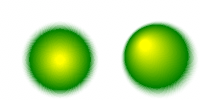

La syntaxe de Mozilla est un peu plus simple mais offre moins de 
possibilités pour les dégradés radiaux. La syntaxe Webkit permet 
par exemple de décentrer un dégradé radial. Cette dernière est 
aussi la seule à supporter actuellement les navigateurs mobiles 
Android et Iphone. 

Il n'est pas certain que cette ancienne syntaxe continue à être 
supportée pendant des années, aussi vous êtes encouragés à toujours 
aussi utiliser la syntaxe pérenne expliquée plus avant. Le navigateur 
utilisera celle qu'il reconnaitra (ou la dernière saisie s'il 
connait les deux). 

#### Support des anciens navigateurs Opera

Opera ne supporte les dégradés que depuis peu mais vous pouvez 
toutefois insérer une image SVG en image de fond. Elle sera plus 
petite et donc plus rapide à télécharger. Elle pourra aussi être 
utilisée dans plusieurs contexte sans avoir une image par taille 
nécessaire. 

#### Support des navigateurs Microsoft Internet Explorer

Pour l'instant (jusqu'à sa version 9 incluse) Internet Explorer 
ne supporte pas de syntaxe CSS pour générer des dégradés. Les 
seules solutions sont de placer une image de taille fixe ou d'utiliser 
une couleur pleine sans dégradé. 

#### Donner l'impression de dégradé pour les boutons

Une solution alternative pour les fonds des titres ou des boutons 
est de simuler un dégradé à l'aide d'aplats de couleur. L'objectif 
est de donner le ressenti d'un dégradé sans en avoir besoin. Le 
plus souvent, si l'objet est petit, il suffit d'avoir en fond 
une couleur clair sur la moitié supérieure et une couleur foncée 
sur la moitié inférieure. Il n'y a besoin d'aucun support particulier 
par le navigateur et d'aucun téléchargement. 

Exemples de boutons à l'aide de deux couleurs pleines, sans dégradé 

En comparant les versions avec et sans dégradé on aura certainement 
une impression négative sur la seconde mais le visiteur ne ressentira 
probablement pas de manque avec cette alternative. 

**Recommandation** : Quand cela est possible, remplacez les 
images de dégradés par des règles CSS 3, ou simulez les avec un 
jeu de deux couleurs. 

### Ombres portées

De la même manière que les coins arrondis et les dégradés, des 
améliorations CSS permettent désormais de réaliser des ombres 
avec quelques lignes de code sans nécessiter de faire télécharger 
des images dédiées par le navigateur. 

Le support des ombres est désormais complet par les navigateurs, 
mais n'existait pas sur Microsoft Internet Explorer sur les 
versions 6, 7 et 8. Sur ces anciennes versions il faudra compenser 
avec une image de fond ou accepter de ne pas afficher d'ombre. 

Il existe deux directives, `box-shadow` pour créer une ombre 
sur un bloc et `text-shadow` pour créer une ombre sous un texte. 
Elles prennent quatre valeurs : 

* un décalage horizontal pour faire en sorte que l'ombre se situe 
  sur un côté, 

* un décalage vertical pour faire en sorte que l'ombre se situe 
  en haut ou en bas, 

* une mesure pour l'entendue du flou autour de l'ombre, 

* la couleur de l'ombre. 

Afin de s'assurer d'un support sur Safari (au moins jusqu'à la 
version 6 incluse) , Iphone (au moins jusqu'à la version 4.2 incluse) 
et Android (2.3 incluse), il faudra ajouter une seconde directive 
préfixée par `-webkit-` : `-webkit-text-shadow`. 

**Recommandation** : Quand cela est possible, remplacez les 
ombres portées réalisées avec des images par des règles CSS 3. 

Éviter les requêtes HTTP non souhaitées
---------------------------------------

Au delà de la réduction du volume de requêtes par regroupement 
ou par remplacement, de nombreuses requêtes HTTP sont présentes 
dans les pages par erreur. Ce sont ces requêtes qu'il nous reste 
à éliminer pour clôturer ce chapitre. 

### Duplications

Les ressources dupliquées sont les cas les plus courants de ces 
requêtes non souhaitées. On les retrouve fréquemment sur les 
sites gérés par des logiciels clefs en main avec beaucoup de modules 
ajoutés les uns aux autres. 

En étudiant la liste des ressources il arrive qu'on remarque 
qu'un même composant est chargé plusieurs fois. Ce peut être 
simplement deux balises <script> utilisant la même adresse 
ou un même composant chargé via des adresses proches (une qui 
contient un paramètre et l'autre non), par deux serveurs distincts 
(le chargement de jquery une fois par Google et une fois en local 
sur le site), ou dans des versions proches. 

Ces duplications imposent au navigateur de charger plusieurs fois le composant. Quand il s'agit de bibliothèques javascript de près de 100 Ko l'impact sur les performances est important. Pour traquer ces cas regardez la liste des ressources CSS et javascript téléchargées et traquez des noms similaires.

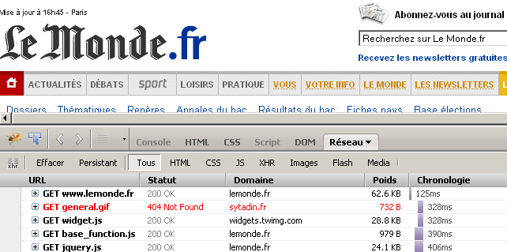

Dans le cas d'images, cela peut être plusieurs images proches 
: couleurs proches, dégradés similaires, arrondis. Ces images 
peuvent généralement être regroupés avec un minimum de compromis 
avec le graphiste. Cela améliorera l'homogénéité du site, simplifiera 
les développements et améliorera les performances. 

**Recommandation** : Traquez et éliminez les composants chargés 
plusieurs fois par erreur et les images proches. 

### Manque de cache sur les réactualisations

Quand le navigateur tente de réactualiser une page sur requête 
de l'utilisateur, il ignore son éventuel cache et envoie des 
entêtes HTTP pour que les proxys intermédiaires ignorent eux 
aussi la version éventuellement en cache. Les objets liés sont 
eux aussi retéléchargés peu importe le statut du cache. 

Ce comportement est toutefois le même quand la réactualisation 
est automatique avec l'entête HTTP `Refresh`. Si l'entête est 
peu utilisée telle quelle, on la trouve parfois dans une balise 
`<meta>` pour faire des redirections. 

~~~~~~~ {.oneline}
<meta http-equiv=refresh content="0; url=http://new-page" />
~~~~~~~

Afin de ne pas mettre en échec les éléments déjà présents dans 
le cache, les redirections simples doivent à la place être réalisées 
par un code de retour HTTP (301, 302 ou 307 suivant les cas) et l'entête 
`Location`. En PHP par exemple cela peut être fait avec `header("Location: 
http://new-page/")`. 

S'il s'agit d'une actualisation différée alors un code javascript 
à l'aide de `document.location` et `window.setTimeout` peut 
remplacer la balise `<meta>`. 

~~~~~~~ {.oneline .javascript}
window.setTimeout( function() { document.location = "…" ; }, 1000) ;
~~~~~~~

**Recommandation** : Éliminez les entêtes « refresh » présente 
dans les entêtes HTTP ou dans les balises <meta>. Remplacez les 
par des redirections HTTP ou des compteurs javascript. 

### URL vides

Les navigateurs ont un comportement peu intuitif quand on spécifie 
une adresse vide, par exemple avec un attribut `src=""` ou `href=""`. 
Le navigateur interprète ces adresses comme des adresses relatives 
par rapport à la page courante. Une adresse relative vide référence 
alors tout simplement la page courante. 

En conséquence une image, un code javascript, une feuille de 
style, ou un composant quelconque avec une adresse vide référence 
tout simplement la page courante. Le navigateur se retrouve 
contraint de retélécharger la page HTML avant d'échouer à l'interpréter 
comme une image, du javascript ou comme une feuille de style. 

Ces adresses vides impliquent donc une requête HTTP, le téléchargement 
d'une page HTML qui fait parfois plus de 100 Ko puis une tentative 
d'interpréter cette page HTML comme si c'était un autre type 
de contenu. 

**Recommandation** : Traquez et éliminez les références à des 
URL vides. 

### Détection de jeu de caractères

Les navigateurs devraient recevoir le jeu de caractères à utiliser 
pour la page dans l'entête HTTP `Content-Type`. 

~~~~~~~ {.oneline .http .response .partial}
Content-Type: text/html;charset=UTF-8
~~~~~~~

Malheureusement certaines sites ne le spécifient pas, ou mal. 
Les navigateurs cherchent donc à détecter quel est le bon jeu de 
caractères. Pour les y aider les développeurs peuvent donc spécifier 
l'entête `Content-Type` dans les balises `<meta http-equiv>`. 

~~~~~~~ {.oneline .html .partial}
<meta http-equiv="Content-Type" content="text/html;charset=UTF-8">
~~~~~~~

Lors de l'interprétation de la page HTML les navigateurs tentent 
de chercher ces balises `<meta>` dans les premiers milliers 
de caractères. Si votre serveur envoie la page en plusieurs bloc 
(l'entête arrivant immédiatement le temps que le corps de la 
page soit calculé) le navigateur pourrait ne pas en profiter 
puisqu'il attend la suite avant de réaliser le rendu. 

De plus, si le jeu de caractères trouvé n'est pas celui attendu 
le navigateur se doit de recommencer l'interprétation de la 
page. Ce faisant il perd un peu de temps mais certains navigateurs 
vont jusqu'à télécharger une seconde fois les composants qu'ils 
avaient commencer à télécharger. 

**Recommandation** : Précisez le bon jeu de caractères dans 
les entêtes HTTP et placez en plus le `<meta>` correspondant 
le plus haut possible dans votre page, si possible avant toute 
autre balise du `<head>`. 

### Adresses en erreur

Enfin, et bien que cela soit étonnant, de nombreux sites contiennent 
des liens ou des références vers des fichiers inexistants (javascript, 
CSS, images). Ces fichiers ont pu exister à un moment, et ne sont 
plus utilisés. Les références restent dans certains gabarits 
et provoquent des erreurs 404. 

Malheureusement ces références cassées ne se voient pas lors 
du test ou de la visite de la page si on ne fait pas attention. Seules 
les performances s'en ressortent puisqu'il faut télécharger 
la page d'erreur en lieu et place du composant initial, inutilement. 
Parfois ces pages d'erreur dépassent 100 Ko. 

**Recommandation** : Vérifiez la présence de références vers 
des composants ayant changé d'adresse ou ayant été supprimés 
(ou liés avec la mauvaise adresse) et corrigez les. 

Vous pouvez vérifier la présence ou l'absence de liens cassés 
avec webpagetest.org ou Firebug. Les pages d'erreur 404 apparaitront 
en rouge. 

Un des premiers composants référencés sur lemonde.fr est une 
erreur 404 

À retenir
---------

* Le nombre de requêtes HTTP est l'un des principaux facteurs 
  de ralentissement des pages web ; 

* Regroupez les composants javascript et les feuilles de style 
  en un seul fichier ; 

* Réalisez des sprites CSS pour charger plusieurs images en 
  une fois ; 

* Chargez les petites images présentes sur toutes les pages 
  par un système de téléchargement par lot comme les liens en 
  data: ; 

* Évitez les redirections HTTP ; 

* Profitez des nouvelles fonctionnalités CSS 3 pour remplacer 
  certaines images ; 

* Faites attention aux composants chargés inutilement plusieurs 
  fois.
